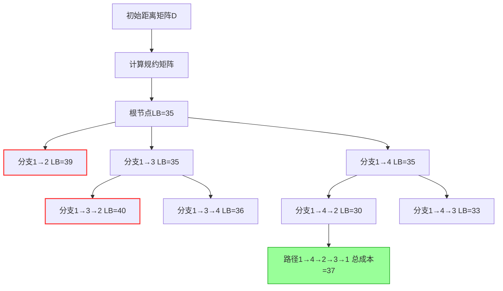

---
---

## 问题定义

**旅行商问题**是组合优化中的经典问题，定义为：给定 ( n ) 个城市和两两城市之间的旅行成本（距离），寻找一条访问每个城市恰好一次并返回起点的回路，使得总旅行成本最小。形式化表示为：

- 输入：距离矩阵
  $D = [d_{ij}]_{n \times n}$
  其中$d_ij$表示城市 ( i ) 到 ( j ) 的成本。
- 输出：排列
  $\pi = (\pi_1, \pi_2, \dots, \pi_n)$
- 使得总成本最小：
  $\text{总成本} = \sum_{i=1}^{n-1} d_{\pi_i, \pi_{i+1}} + d_{\pi_n, \pi_1}$

---

## 分支限界法解题思路

救急视频：[7.3 旅行商问题 - 分支界限法\_哔哩哔哩\_bilibili](https://www.bilibili.com/video/BV1iTGbzsEfP/?spm_id_from=333.337.search-card.all.click&vd_source=7675af15891f3aabbc21b6f21ceaaf33)

### 1. **状态表示**

- 部分路径表示为一个已访问城市的序列，例如 ([1,3,2]) 表示已访问城市
- $1 \to 3 \to 2$

### 2. **分支策略**

- **分支操作**：每次扩展当前路径，添加一个未访问的城市。
  - 例如，当前路径为 ([1,3])，未访问城市为 (2,4,5)，则生成子节点 ([1,3,2])、([1,3,4])、([1,3,5])。

### 3. **限界策略**

- **下界计算**：使用规约成本矩阵（Reduced Cost Matrix）计算每个部分路径的最小可能总成本。
- **剪枝条件**：若某分支的下界超过当前已知最优解的总成本，则剪枝该分支。

### 4. **搜索策略**

- **优先级队列**：按节点的下界值排序，优先扩展下界最小的节点（最小堆）。

## 算法步骤：

1. **初始化**：
   - 将根节点（起始城市）加入队列，计算其规约矩阵和下界。
   - 初始化全局最优解
   - $\text{UB} = \infty$
2. **循环处理**：- **选择节点**：从队列中取出下界最小的节点。- **剪枝**：若节点下界
   $\geq \text{UB}$
   跳过。- **扩展分支**：生成所有可能的子节点。- **更新规约矩阵**：为每个子节点计算新的规约矩阵和下界。- **更新最优解**：若子节点为完整路径且成本更小，更新 UB
3. **终止条件**：队列为空，输出最优解。

---

## 规约矩阵

### 核心思想

通过调整距离矩阵，使得每一行和每一列至少有一个零，从而得到更紧的下界。调整过程中减去的数值总和即为下界。

### 计算步骤：

<!-- Column 1 -->

4. **行规约**：
   - 对每一行，减去该行的最小值。
   - 行规约数
   - $R[i] = \text{第} i \text{行最小值}$
   - 总行规约数
   - $\text{TR} = \sum_{i=1}^n R[i]$

<!-- Column 2 -->

5. **列规约**：
   - 对每一列，减去该列的最小值。
   - 列规约数
   - $C[j] = \text{第} j \text{列最小值}$
   - 总列规约数
   - $\text{TC} = \sum_{j=1}^n C[j]$

6. **总下界**：
   $\text{下界} = \text{TR} + \text{TC}$

### 示例

给定 5 个城市的距离矩阵 D
$D = \begin{bmatrix}
\infty & 20 & 30 & 10 & 11 \\
15 & \infty & 16 & 4 & 2 \\
3 & 5 & \infty & 2 & 4 \\
19 & 6 & 18 & \infty & 3 \\
16 & 4 & 7 & 16 & \infty
\end{bmatrix}$

<!-- Column 1 -->

**步骤 1：行规约**

- 第 1 行最小值 $R[1] = 10$，减去 10：
  $\begin{bmatrix}
\infty & 10 & 20 & 0 & 1
\end{bmatrix}$
- 其他行类似操作，得到行规约矩阵RM：
  $RM = \begin{bmatrix}
\infty & 10 & 20 & 0 & 1 \\
13 & \infty & 14 & 2 & 0 \\
1 & 2 & \infty & 0 & 2 \\
16 & 3 & 15 & \infty & 0 \\
12 & 0 & 3 & 12 & \infty
\end{bmatrix}$
  总行规约数
  $\text{TR} = 10 + 2 + 2 + 3 + 4 = 21$

<!-- Column 2 -->

**步骤 2：列规约**

- 第 1 列最小值
  $C[1] = 1$
  减去 1：
  $\begin{bmatrix}
\infty & 10 & 17 & 0 & 1 \\
12 & \infty & 11 & 2 & 0 \\
0 & 2 & \infty & 0 & 2 \\
15 & 3 & 12 & \infty & 0 \\
11 & 0 & 0 & 12 & \infty
\end{bmatrix}$
  其他列无需调整，总列规约数

**总下界**：
$\text{下界} = 21 + 4 = 25$

---

## 来个例题

### 基于分支限界法的4城市TSP问题完整解答（修正版）

### **问题描述**

给定4个城市的距离矩阵 ( D )，求解最短汉密顿回路：

$D = \begin{bmatrix}
\infty & 10 & 15 & 20 \\
5 & \infty & 9 & 10 \\
6 & 13 & \infty & 12 \\
8 & 8 & 9 & \infty
\end{bmatrix}$

---

### **解题步骤**

### **1. 根节点初始化**

**规约矩阵计算**

- **行规约**：对每行减去最小值，得到行规约矩阵：

$RM = \begin{bmatrix}
\infty & 0 & 5 & 10 \quad (\text{减 }10) \\
0 & \infty & 4 & 5 \quad (\text{减 }5) \\
0 & 7 & \infty & 6 \quad (\text{减 }6) \\
0 & 0 & 1 & \infty \quad (\text{减 }8)
\end{bmatrix}$

行规约总和 ( $\text{TR} = 10 + 5 + 6 + 8 = 29$ )。

- **列规约**：对每列减去最小值：
  $\begin{aligned}
\text{列1}: & \quad \min(\infty,0,0,0) = 0 \quad (\text{无需减}) \\
\text{列2}: & \quad \min(0,\infty,7,0) = 0 \quad (\text{无需减}) \\
\text{列3}: & \quad \min(5,4,\infty,1) = 1 \quad (\text{所有列3元素减1}) \\
\text{列4}: & \quad \min(10,5,6,\infty) = 5 \quad (\text{所有列4元素减5})
\end{aligned}$
  列规约后的矩阵：

$RCM = \begin{bmatrix}
\infty & 0 & 4 & 5 \\
0 & \infty & 3 & 0 \\
0 & 7 & \infty & 1 \\
0 & 0 & 0 & \infty
\end{bmatrix}$
列规约总和 ( $\text{TC} = 0 + 0 + 1 + 5 = 6$)。

- **总下界**：( $\text{LB} = \text{TR} + \text{TC} = 29 + 6 = 35$ )。

---

### **2. 扩展根节点**

从根节点生成子节点：[1→2]、[1→3]、[1→4]，计算各子节点下界。

<!-- Column 1 -->

### **子节点 [1→2]**

- **操作**：禁止返回城市1（设置 ($D[2,1] = \infty$ )），更新距离矩阵：
  $D' = \begin{bmatrix}
\infty & \infty & 15 & 20 \\
\infty & \infty & 9 & 10 \\
6 & 13 & \infty & 12 \\
8 & 8 & 9 & \infty
\end{bmatrix}$
- **行规约**：
- $\begin{aligned}
\text{行1}: & \quad \min(\infty, \infty,15,20) =15 \quad (\text{减15}) \\
\text{行2}: & \quad \min(\infty, \infty,9,10) =9 \quad (\text{减9}) \\
\text{行3}: & \quad \min(6,13,\infty,12) =6 \quad (\text{减6}) \\
\text{行4}: & \quad \min(8,8,9,\infty) =8 \quad (\text{减8})
\end{aligned}$
  行规约矩阵：
  $RM' = \begin{bmatrix}
\infty & \infty & 0 & 5 \\
\infty & \infty & 0 & 1 \\
0 & 7 & \infty & 6 \\
0 & 0 & 1 & \infty
\end{bmatrix}$
  行规约总和 ( $\text{TR'} = 15 + 9 + 6 + 8 = 38$ )。
- **列规约**：

$\begin{aligned}
\text{列1}: & \quad \min(\infty, \infty,0,0) =0 \quad (\text{无需减}) \\
\text{列2}: & \quad \min(\infty, \infty,7,0) =0 \quad (\text{无需减}) \\
\text{列3}: & \quad \min(0,0,\infty,1) =0 \quad (\text{无需减}) \\
\text{列4}: & \quad \min(5,1,6,\infty) =1 \quad (\text{列4元素减1})
\end{aligned}$

列规约后的矩阵：
$RCM' = \begin{bmatrix}
\infty & \infty & 0 & 4 \\
\infty & \infty & 0 & 0 \\
0 & 7 & \infty & 5 \\
0 & 0 & 1 & \infty
\end{bmatrix}$
列规约总和
$\text{TC'} = 0 + 0 + 0 + 1 = 1$

- **子节点下界**：
- $\text{LB}_{1→2} = \text{TR'} + \text{TC'} = 38 + 1 = 39$

<!-- Column 2 -->

### **子节点 [1→3]**

- **操作**：禁止返回城市1（设置D[3,1] =无穷），更新距离矩阵：

$D' = \begin{bmatrix}
\infty & 10 & \infty & 20 \\
5 & \infty & 9 & 10 \\
\infty & 13 & \infty & 12 \\
8 & 8 & 9 & \infty
\end{bmatrix}$

- **行规约**：
- $\begin{aligned}
\text{行1}: & \quad \min(10, \infty,20) =10 \quad (\text{减10}) \\
\text{行2}: & \quad \min(5,9,10) =5 \quad (\text{减5}) \\
\text{行3}: & \quad \min(13,12) =12 \quad (\text{减12}) \\
\text{行4}: & \quad \min(8,8,9) =8 \quad (\text{减8})
\end{aligned}$
  行规约矩阵：
  $RM' = \begin{bmatrix}
\infty & 0 & \infty & 10 \\
0 & \infty & 4 & 5 \\
\infty & 1 & \infty & 0 \\
0 & 0 & 1 & \infty
\end{bmatrix}$

行规约总和 ( $\text{TR'} = 10 + 5 + 12 + 8 = 35$ )。

- **列规约**：
  $\begin{aligned}
\text{列1}: & \quad \min(\infty,0,\infty,0) =0 \quad (\text{无需减}) \\
\text{列2}: & \quad \min(0,\infty,1,0) =0 \quad (\text{无需减}) \\
\text{列4}: & \quad \min(10,5,0,\infty) =0 \quad (\text{所有列4元素减0})
\end{aligned}$列规约总和 ( $\text{TC'} = 0$)。
- **子节点下界**： $\text{LB}_{1→3} = 35 + 0 = 35$

<!-- Column 3 -->

### **子节点 [1→4]**

- **操作**：禁止返回城市1（设置 ($D[4,1] = \infty$ )），更新距离矩阵：
  $D' = \begin{bmatrix}
\infty & 10 & 15 & \infty \\
5 & \infty & 9 & 10 \\
6 & 13 & \infty & 12 \\
\infty & 8 & 9 & \infty
\end{bmatrix}$
- **行规约**：
  $\begin{aligned}
\text{行1}: & \quad \min(10,15) =10 \quad (\text{减10}) \\
\text{行2}: & \quad \min(5,9,10) =5 \quad (\text{减5}) \\
\text{行3}: & \quad \min(6,13,12) =6 \quad (\text{减6}) \\
\text{行4}: & \quad \min(8,9) =8 \quad (\text{减8})
\end{aligned}$
  行规约矩阵：
  $RM' = \begin{bmatrix}
\infty & 0 & 5 & \infty \\
0 & \infty & 4 & 5 \\
0 & 7 & \infty & 6 \\
\infty & 0 & 1 & \infty
\end{bmatrix}$
  行规约总和 $\text{TR'} = 10 + 5 + 6 + 8 = 29$。
- **列规约**：
  $[
\begin{aligned}
\text{列1}: & \quad \min(\infty,0,0,\infty) =0 \quad (\text{无需减}) \\
\text{列2}: & \quad \min(0,\infty,7,0) =0 \quad (\text{无需减}) \\
\text{列3}: & \quad \min(5,4,\infty,1) =1 \quad (\text{所有列3元素减1}) \\
\text{列4}: & \quad \min(\infty,5,6,\infty) =5 \quad (\text{所有列4元素减5})
\end{aligned}
]$
  列规约后的矩阵：

$RCM' = \begin{bmatrix}
\infty & 0 & 4 & \infty \\
0 & \infty & 3 & 0 \\
0 & 7 & \infty & 1 \\
\infty & 0 & 0 & \infty
\end{bmatrix}$

列规约总和 ($\text{TC'} = 0 + 0 +1 +5 =6$ )。

- **子节点下界**：( $\text{LB}_{1→4} = 29 + 6 = 35$ )。

---

---

### **3. 剪枝与扩展**

- **优先级队列**：按子节点下界排序：
  - [1→2]（LB=39）
  - [1→3]（LB=35）
  - [1→4]（LB=35）

根据LowestCost选择法，优先扩展下界最小的节点 [1→3] 和 [1→4]。

---

### **4. 扩展节点 [1→4]**

- **当前路径**：[1→4]
- **剩余未访问城市**：2,3
- **生成子节点**：[1→4→2]、[1→4→3]

<!-- Column 1 -->

### **子节点 [1→4→2]**

- **操作**：禁止返回城市4（设置 ( D[2,4] = \infty )），更新距离矩阵：

$D'' = \begin{bmatrix}
\infty & 10 & 15 & \infty \\
5 & \infty & 9 & \infty \\
6 & 13 & \infty & 12 \\
\infty & \infty & 9 & \infty
\end{bmatrix}$

- **行规约**：

$\begin{aligned}
\text{行1}: & \quad \min(10,15) =10 \quad (\text{减10}) \\
\text{行2}: & \quad \min(5,9) =5 \quad (\text{减5}) \\
\text{行3}: & \quad \min(6,13,12) =6 \quad (\text{减6}) \\
\text{行4}: & \quad \min(\infty,9) =9 \quad (\text{减9})
\end{aligned}$

行规约矩阵：

$RM'' = \begin{bmatrix}
\infty & 0 & 5 & \infty \\
0 & \infty & 4 & \infty \\
0 & 7 & \infty & 6 \\
\infty & \infty & 0 & \infty
\end{bmatrix}$

行规约总和 $\text{TR''} = 10 + 5 + 6 + 9 = 30$

- **列规约**：
  $\begin{aligned}
\text{列1}: & \quad \min(\infty,0,0,\infty) =0 \quad (\text{无需减}) \\
\text{列2}: & \quad \min(0,\infty,7,\infty) =0 \quad (\text{无需减}) \\
\text{列3}: & \quad \min(5,4,\infty,0) =0 \quad (\text{列3元素减0})
\end{aligned}$
  列规约总和
  $\text{TC''} = 0$
- **子节点下界**：
- $\text{LB}_{1→4→2} = 30 + 0 = 30$

---

<!-- Column 2 -->

### **子节点 [1→4→3]**

- **操作**：禁止返回城市4,设置
- $D[3,4] = \infty$
- 更新距离矩阵：

$D'' = \begin{bmatrix}
\infty & 10 & 15 & \infty \\
5 & \infty & 9 & 10 \\
6 & 13 & \infty & \infty \\
\infty & 8 & \infty & \infty
\end{bmatrix}$

- **行规约**：

$\begin{aligned}
\text{行1}: & \quad \min(10,15) =10 \quad (\text{减10}) \\
\text{行2}: & \quad \min(5,9,10) =5 \quad (\text{减5}) \\
\text{行3}: & \quad \min(6,13) =6 \quad (\text{减6}) \\
\text{行4}: & \quad \min(8) =8 \quad (\text{减8})
\end{aligned}$

行规约矩阵：
$RM'' = \begin{bmatrix}
\infty & 0 & 5 & \infty \\
0 & \infty & 4 & 5 \\
0 & 7 & \infty & \infty \\
\infty & 0 & \infty & \infty
\end{bmatrix}$
行规约总和
$\text{TR''} = 10 + 5 + 6 + 8 = 29$

- **列规约**：
  $\begin{aligned}
\text{列1}: & \quad \min(\infty,0,0,\infty) =0 \quad (\text{无需减}) \\
\text{列2}: & \quad \min(0,\infty,7,0) =0 \quad (\text{无需减}) \\
\text{列3}: & \quad \min(5,4,\infty,\infty) =4 \quad (\text{所有列3元素减4})
\end{aligned}$
  列规约后的矩阵：
  $RCM'' = \begin{bmatrix}
\infty & 0 & 1 & \infty \\
0 & \infty & 0 & 5 \\
0 & 7 & \infty & \infty \\
\infty & 0 & \infty & \infty
\end{bmatrix}$
  列规约总和
  $\text{TC''} = 4$
- **子节点下界**：
- $\text{LB}_{1→4→3} = 29 + 4 = 33$

---

### **5. 更新最优解**

- **当前队列**：
  - [1→4→2]（LB=30）
  - [1→4→3]（LB=33）
  - [1→3]（LB=35）
  - [1→2]（LB=39）

优先扩展 [1→4→2]，发现剩余未访问城市为3，路径补全为[1→4→2→3→1]，实际总成本：
$10 (1→4) + 8 (4→2) + 13 (2→3) + 6 (3→1) = 37$

---

### **最终结果**

- **最优路径**：$[1→4→2→3→1]$
- **总成本**：37

---

### **关键总结**

7. **规约矩阵**：通过行/列规约剥离冗余成本，计算下界。
8. **优先级扩展**：使用最小堆选择**下界最小**的节点，这将有助于找到尽量短的距离。
9. **剪枝策略**：下界超过当前最优解时终止分支。
10. **路径回溯**：通过动态规划或路径记录回溯最优路径。
11. **时间复杂度**：最坏情况下为 $O(n!)$，但实际通过剪枝大幅优化。
