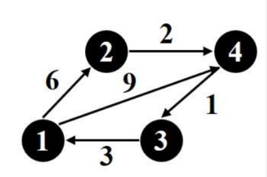

# 第 5 章 动态规划

---

## 1. 本章概述

动态规划是一种通过将原问题拆解为若干**相互重叠的子问题**，并利用子问题的最优解递推得到原问题最优解的算法设计方法。它适用于具有**最优子结构**和**重叠子问题**两大性质的问题——即问题的最优解包含其子问题的最优解，且不同子问题会反复出现。本章覆盖矩阵乘法链、0/1 背包、最长公共子序列、装配线调度、编辑距离、最大子段和、最大子集和、Floyd 最短路径等经典 DP 问题。

| **适用问题** | 适用于具有**最优子结构**和**重叠子问题**性质的最优化问题，如 0/1 背包问题、矩阵乘法链和最长公共子序列         |
| -------- | ----------------------------------------------------------------- |
| **核心思想** | 将待求解问题分解为一系列**相互联系**的阶段，通过**“记住”已求过的子问题解**（备忘录或填表法）来避免重复计算，从而节省时间 |

---

## 2. 知识点讲解

---

### 2.1 动态规划的基本思想

**通俗定义：**  
把一个大问题分解成一层层的小问题，先解决最小的问题，然后把它们的答案记下来（存表），再用这些答案去解决更大的问题，避免重复计算。就像盖楼一样——先打地基，再砌第一层，第一层稳固了才能砌第二层。

**两个关键性质：**

1. **最优子结构（Optimal Substructure）：**  
   原问题的最优解中包含了子问题的最优解。简单说：如果你想让整体最优，那么整体中的每一部分也必须是它自己那个局部的最优方案。

2. **重叠子问题（Overlapping Subproblems）：**  
   在递归求解过程中，同一个子问题会被反复求解多次。动态规划通过**查表**来避免重复计算，这是它和普通递归分治（如归并排序）的本质区别。

**动态规划的一般步骤（四步法）：**

1. **定义状态** —— 设计 $f(i, j, \dots)$ 表示什么意义下的最优值。
2. **写出递归方程** —— 找到状态之间的转移关系，即 $f(\dots)$ 如何由更小规模的 $f(\dots)$ 计算得到。
3. **确定初值/边界** —— 最小子问题（如 $i=j$、$y=0$ 等）的答案是什么。
4. **递推求解并重构** —— 按规模从小到大计算，最后从表中回溯出具体方案。

**初学易错点：**
- ❌ 把"递归"当"动态规划"——只有递归没有记忆化（查表）就还是指数级复杂度。
- ❌ 混淆了 0/1 背包和贪心——贪心每一步选当前最优，DP 考虑所有可能性后再取最优。
- ❌ 写递推时忘记处理边界条件（如 $i=0$、$y < w_i$ 等情况）。
- ❌ 回溯时不会倒推——从最终状态往回走，每一步判断当前最优值是从哪个子问题来的。

---

### 2.2 最优子结构的证明方法

**通俗定义：**  
对于一个问题，如果能证明"原问题最优解中的任一子部分，也必须是那个子问题的最优解"，那么就说它有最优子结构。

**证明套路（反证法）：**

1. 假设 $(x_1, x_2, \dots, x_n)$ 是原问题的一个最优解。
2. 取出它的某一部分（比如前 $n-1$ 个决策），称它为子问题的候选解。
3. 假设这个子问题有另一个更优的解 $(x'_1, \dots, x'_{n-1})$。
4. 用这个更优的解替换原最优解中的对应部分，得到原问题的一个新解。
5. 如果新解比原来的最优解更好，就产生了矛盾。

**举例（以 0/1/2 背包为例）：**  

设有 n 个物品和容量 c 的背包，$(x_1, x_2, \dots, x_n)$ 是最优解（$x_i \in \{0,1,2\}$）。  
对于子问题——前 $n-1$ 个物品、容量为 $c - x_n w_n$——假设 $(x_1, \dots, x_{n-1})$ 不是最优的。  
那么存在一个更优的 $(y_1, \dots, y_{n-1})$，价值更大。将 $(y_1, \dots, y_{n-1})$ 与 $x_n$ 组合，得到原问题的一个新解，价值比 $(x_1, \dots, x_n)$ 更高——这与最优性矛盾。  
因此 $(x_1, \dots, x_{n-1})$ 必须是该子问题的最优解。

**初学易错点：**
- ❌ 只会套模板，不理解为什么必须用反证法。
- ❌ 替换后忘记验证新解满足约束条件（如不超过容量）。

---

### 2.3 最大子段和问题

**通俗定义：**  
给定一个整数数组（可能有负数），找出一个**连续的子数组**，使得它的和最大。例如 $[-2, 1, -3, 4, -1, 2, 1, -5, 4]$ 的最大子段和为 $6$（对应子数组 $[4, -1, 2, 1]$）。

**标准公式：**  
设 $f(i)$ 为以数组第 $i$ 个元素 **结尾** 的最大子段和（即子段必须包含 $x[i]$），则有：

$$
f(1) = x[1]
$$

$$
f(i) = \max\{x[i],\; f(i-1) + x[i]\},\quad i = 2,3,\dots,n
$$

最终答案为 $\displaystyle \max_{1 \le i \le n} f(i)$。

**举例：**  

$x = [2, -5, 3, 4, -1]$

| $i$ | $x[i]$ | $f(i)$ 计算 | $f(i)$ |
|-----|--------|-------------|--------|
| 1 | 2 | $f(1)=2$ | 2 |
| 2 | -5 | $\max\{-5, 2+(-5)=-3\} = -3$ | -3 |
| 3 | 3 | $\max\{3, -3+3=0\} = 3$ | 3 |
| 4 | 4 | $\max\{4, 3+4=7\} = 7$ | 7 |
| 5 | -1 | $\max\{-1, 7+(-1)=6\} = 6$ | 6 |

最优值：$\max\{2, -3, 3, 7, 6\} = 7$，对应子段 $[3, 4, -1]$（从第 3 到第 5 个元素？不对，最优值 $7$ 对应的 $f(4)=7$ 是以第 4 个元素结尾，即子段为 $[3,4]$，和为 $3+4=7$）。

**初学易错点：**
- ❌ 误以为子段"越长越好"——负数会拖累总和，所以 $f(i-1)+x[i] < x[i]$ 时要果断从 $x[i]$ 重新开始。
- ❌ 忘记比较所有 $f(i)$ 取最大值——$f(n)$ 不一定最大。
- ❌ 起始点追踪错误——必须在 $f(i)$ 重新开始时更新起始位置。

---

### 2.4 矩阵乘法链问题

**通俗定义：**  
有一串矩阵 $A_1 \times A_2 \times \dots \times A_n$，矩阵乘法满足结合律，但不同的结合顺序（加括号方式）会导致总标量乘法次数天差地别。问题是要找到**标量乘法次数最少**的加括号方式。

**核心概念：**  
设矩阵 $A_i$ 的维度为 $p_{i-1} \times p_i$（即 $A_i$ 有 $p_{i-1}$ 行、$p_i$ 列）。  
两个矩阵 $A_{p\times q} \times B_{q \times r}$ 相乘，需要 $p \times q \times r$ 次标量乘法。

**标准公式：**  
设 $m[i][j]$ 表示计算 $A_i \times A_{i+1} \times \dots \times A_j$ 所需的最少标量乘法次数。

$$
m[i][i] = 0,\quad i = 1,2,\dots,n
$$

$$
m[i][j] = \min_{i \le k < j} \big\{ m[i][k] + m[k+1][j] + p_{i-1} \cdot p_k \cdot p_j \big\},\quad i < j
$$

其中 $k$ 是分割点：先计算 $A_i \dots A_k$（结果为 $p_{i-1} \times p_k$ 矩阵），再计算 $A_{k+1} \dots A_j$（结果为 $p_k \times p_j$ 矩阵），最后将两个结果相乘。

**举例：**  

四矩阵 $A_1(10\times20), A_2(20\times40), A_3(40\times1), A_4(1\times90)$，维度序列 $p = (10, 20, 40, 1, 90)$。

计算过程（按链长递增）：

**链长 1：** $m[1][1]=m[2][2]=m[3][3]=m[4][4]=0$

**链长 2：**
- $m[1][2] = 0+0+10\cdot20\cdot40 = 8000$
- $m[2][3] = 0+0+20\cdot40\cdot1 = 800$
- $m[3][4] = 0+0+40\cdot1\cdot90 = 3600$

**链长 3：**
- $m[1][3] = \min\begin{cases}
k=1: & m[1][1]+m[2][3]+10\cdot20\cdot1 = 0+800+200 = 1000 \\
k=2: & m[1][2]+m[3][3]+10\cdot40\cdot1 = 8000+0+400 = 8400
\end{cases} = 1000$
- $m[2][4] = \min\begin{cases}
k=2: & m[2][2]+m[3][4]+20\cdot40\cdot90 = 0+3600+72000 = 75600 \\
k=3: & m[2][3]+m[4][4]+20\cdot1\cdot90 = 800+0+1800 = 2600
\end{cases} = 2600$

**链长 4：**
- $m[1][4] = \min\begin{cases}
k=1: & m[1][1]+m[2][4]+10\cdot20\cdot90 = 0+2600+18000 = 20600 \\
k=2: & m[1][2]+m[3][4]+10\cdot40\cdot90 = 8000+3600+36000 = 47600 \\
k=3: & m[1][3]+m[4][4]+10\cdot1\cdot90 = 1000+0+900 = 1900
\end{cases} = 1900$

最优乘法次数为 **1900**，最优分割点 $k=3$，即 $(A_1A_2A_3) \times A_4$。  
再追溯 $m[1][3]=1000$ 在 $k=1$ 取得，即 $A_1 \times (A_2A_3)$。  
因此最优加括号方式为：$\boxed{(A_1 \times (A_2 \times A_3)) \times A_4}$。

**初学易错点：**
- ❌ 搞混 $p$ 数组的下标——$p_{i-1}$ 和 $p_i$ 对应 $A_i$ 的行和列，记住 $p$ 的长度是 $n+1$。
- ❌ 在递推时忘记加 $p_{i-1}\cdot p_k \cdot p_j$ 这一步——这是合并左右两部分的乘法代价。
- ❌ 只计算最小值，没有记录分割点 $k$——回溯时需要知道在哪里切开。
- ❌ 认为所有加括号方式乘法次数一样——这是错的，例子中 $1900$ 和 $47600$ 相差 25 倍。

---

### 2.5 0/1 背包问题

**通俗定义：**  
你有一个容量为 $c$ 的背包和 $n$ 个物品，每个物品 $i$ 有重量 $w_i$ 和价值 $p_i$。每个物品要么**拿走（1）** 要么**不拿（0）**，不能分割。问怎样装能让背包里物品的总价值最大。

**标准公式（反向定义——从第 $i$ 个物品考虑到第 $n$ 个）：**  

设 $f(i, y)$ 为考虑物品 $i, i+1, \dots, n$，背包剩余容量为 $y$ 时所能获得的最大总价值。

$$
f(n, y) = \begin{cases}
p_n, & y \ge w_n \\
0, & 0 \le y < w_n
\end{cases}
$$

$$
f(i, y) = \begin{cases}
\max\big\{ f(i+1, y),\; f(i+1, y-w_i) + p_i \big\}, & y \ge w_i \\[6pt]
f(i+1, y), & 0 \le y < w_i
\end{cases}
$$

**正向定义——从第 1 个物品考虑到第 $i$ 个：**  

设 $g(i, y)$ 为考虑物品 $1, 2, \dots, i$，背包容量为 $y$ 时的最大总价值。

$$
g(0, y) = 0,\quad \forall y
$$

$$
g(i, y) = \begin{cases}
\max\big\{ g(i-1, y),\; g(i-1, y-w_i) + p_i \big\}, & y \ge w_i \\[6pt]
g(i-1, y), & 0 \le y < w_i
\end{cases}
$$

最终答案：$f(1, c)$ 或 $g(n, c)$。

**元组法（优化存储）：**  
背包容量 $c$ 很大时，$c \times n$ 的表太占空间。元组法只记录每个 $f(i, y)$ 中**可达的状态对**（价值, 重量），并利用**支配规则**删除无用状态：

- 对于两个状态 $(v_1, w_1)$ 和 $(v_2, w_2)$，如果 $v_1 \le v_2$ 且 $w_1 \ge w_2$，则 $(v_1, w_1)$ 被**支配**，可以删除（因为 $(v_2, w_2)$ 价值更高、重量更轻，全面优于它）。

**举例（元组法）：**  

$n=4, c=20, w=(10,15,6,9), p=(2,5,8,1)$

从后往前递推，$P(i)$ 表示 $f(i, y)$ 的所有可达状态对集合：

**$P(5)$：** 没有物品可选，只有空集 $\{(0,0)\}$。

**$P(4)$：** 物品 4（$w=9, p=1$）
- 不选物品 4 → $(0,0)$
- 选物品 4 → $(1,9)$
- $P(4) = \{(0,0), (1,9)\}$（无支配关系）

**$P(3)$：** 物品 3（$w=6, p=8$）
- $Q = \{(0+8, 0+6), (1+8, 9+6)\} = \{(8,6), (9,15)\}$
- 合并 $P(4)$ 与 $Q$:
  - $(0,0)$ 保留
  - $(1,9)$ 与 $(8,6)$ 比较：价值 $1<8$ 且重量 $9>6$ → 被 $\mathbf{(8,6)}$ 支配，删除
  - $(8,6)$ 保留
  - $(9,15)$ 保留
- $P(3) = \{(0,0), (8,6), (9,15)\}$

**$P(2)$：** 物品 2（$w=15, p=5$）
- $Q = \{(0+5, 0+15), (8+5, 6+15), (9+5, 15+15)\} = \{(5,15), (13,21), (14,30)\}$
- 过滤超重：$(13,21)$ 重量 $21>c=20$ 删除，$(14,30)$ 重量 $30>20$ 删除
- $Q = \{(5,15)\}$
- 合并 $P(3)$ 与 $Q$:
  - $(0,0)$ 保留
  - $(8,6)$ 保留
  - $(5,15)$ 与 $(9,15)$ 比较：价值 $5<9$ 且同重量 → 被 $\mathbf{(9,15)}$ 支配，删除
  - $(9,15)$ 保留
- $P(2) = \{(0,0), (8,6), (9,15)\}$

**$P(1)$：** 物品 1（$w=10, p=2$）
- $Q = \{(0+2, 0+10), (8+2, 6+10), (9+2, 15+10)\} = \{(2,10), (10,16), (11,25)\}$
- 过滤超重：$(11,25)$ 重量 $25>20$ 删除
- $Q = \{(2,10), (10,16)\}$
- 合并 $P(2)$ 与 $Q$:
  - $(0,0)$ 保留
  - $(8,6)$ 保留
  - $(2,10)$ 与 $(8,6)$ 比较：价值 $2<8$ 但重量 $10>6$ → 被 $\mathbf{(8,6)}$ 支配，删除
  - $(9,15)$ 保留
  - $(10,16)$ 与 $(9,15)$ 比较：价值 $10>9$ 但重量 $16>15$ → 都不支配对方，保留
- $P(1) = \{(0,0), (8,6), (9,15), (10,16)\}$

最优价值为 $P(1)$ 中最大价值且重量 $\le c$ 的：$(10,16)$ → 最优价值 $=10$。

**回溯：**
- 从 $(10,16)$ 开始，它来自 $Q$ → 物品 1 被选（$x_1=1$）。剩余容量 $20-10=10$。
- 在 $P(2)$ 中容量 $10$ 下的最佳状态：$(8,6)$，来自 $P(3)$ → 物品 2 未选（$x_2=0$）。
- 在 $P(3)$ 中：$(8,6)$ 来自 $Q$ → 物品 3 被选（$x_3=1$）。剩余容量 $10-6=4$。
- 在 $P(4)$ 中容量 $4$ 下的最佳状态：$(0,0)$，来自 $P(5)$ → 物品 4 未选（$x_4=0$）。

**最优解：** $\{1, 3\}$，总重量 $10+6=16 \le 20$，总价值 $2+8=10$。

**初学易错点：**
- ❌ 把元组法中的"支配"理解反了——价值**更高**且重量**更轻**才叫支配。
- ❌ 忘记过滤超重状态（重量 $> c$）。
- ❌ 回溯时搞混方向——要倒着走，根据当前状态来自 $Q$（选）还是来自原 $P$（不选）来判断。
- ❌ 混淆正向和反向定义中 $f(i,y)$ 的 $i$ 含义。

---

### 2.6 最长公共子序列（LCS）

**通俗定义：**  
给定两个字符串 $A$ 和 $B$，找出一个最长的字符串，使得它既是 $A$ 的子序列（不要求连续，但顺序不变），也是 $B$ 的子序列。例如 $A = \text{"ABCBDAB"}$，$B = \text{"BDCAB"}$，LCS 为 $\text{"BCAB"}$（长度 4）。

**标准公式：**  
设 $c[i][j]$ 表示 $A[1..i]$ 与 $B[1..j]$ 的最长公共子序列长度。

$$
c[i][0] = 0,\quad c[0][j] = 0,\quad \forall i,j
$$

$$
c[i][j] = \begin{cases}
c[i-1][j-1] + 1, & A[i] = B[j] \\[6pt]
\max\big\{ c[i-1][j],\; c[i][j-1] \big\}, & A[i] \ne B[j]
\end{cases}
$$

**举例：**  

$A = \text{"ABCBDAB"},\; B = \text{"BDCAB"}$（略，在典型例题中详述）。

**初学易错点：**
- ❌ 混淆"子序列"和"子串"——子序列可以不连续，子串必须连续。
- ❌ 当 $A[i] \ne B[j]$ 时忘记取 $\max$——要同时考虑跳过 $A[i]$ 和跳过 $B[j]$ 两种情况。
- ❌ 回溯时只走一条分支——如果 $c[i-1][j] = c[i][j-1]$，两条路都可能得到不同的 LCS。

---

### 2.7 装配线调度问题

**通俗定义：**  
有两个并行的装配线，每个线上有 $n$ 个工站。同一个装配站的功能在两条线上是一样的，但花费的时间可能不同。零件可以切换装配线（有切换时间）。问从进入装配线到最终成品出来，最少需要多少时间。

**标准公式：**  

设 $f(i, j)$ 为零件到达第 $i$ 条装配线第 $j$ 个工站的最短时间。

**边界（第一个工站）：**
$$
f(1, 1) = \text{in}[1] + \text{cost}[1][1]
$$
$$
f(2, 1) = \text{in}[2] + \text{cost}[2][1]
$$

**递推（$j \ge 2$）：**
$$
f(1, j) = \min\big\{ f(1, j-1) + \text{cost}[1][j],\; f(2, j-1) + \text{trans}[2][j] + \text{cost}[1][j] \big\}
$$
$$
f(2, j) = \min\big\{ f(2, j-1) + \text{cost}[2][j],\; f(1, j-1) + \text{trans}[1][j] + \text{cost}[2][j] \big\}
$$

**最终完成时间：**
$$
f_{\min} = \min\big\{ f(1, n) + \text{out}[1],\; f(2, n) + \text{out}[2] \big\}
$$

**初学易错点：**
- ❌ 忘记加上 $\text{in}[i]$（进入装配线的时间）和 $\text{out}[i]$（退出时间）。
- ❌ 切换时只加了 $\text{trans}$ 但忘了原来那条线的累积时间 $f(\dots, j-1)$。
- ❌ 认为每个 $j$ 必须选同一根线——切换是允许的，代价就是 $\text{trans}$。

---

### 2.8 编辑距离问题

**通俗定义：**  
给定两个字符串 $A$ 和 $B$，可以对 $A$ 进行三种操作：删除一个字符、插入一个字符、替换一个字符。问最少需要多少次操作才能把 $A$ 变成 $B$。

**标准公式：**  
设 $d[i][j]$ 表示将 $A[1..i]$ 变换为 $B[1..j]$ 的最小编辑距离。

$$
d[i][0] = i,\quad d[0][j] = j,\quad \forall i,j
$$

$$
d[i][j] = \min\begin{cases}
d[i-1][j] + 1 & \text{（删除 $A[i]$）} \\[2pt]
d[i][j-1] + 1 & \text{（插入 $B[j]$）} \\[2pt]
d[i-1][j-1] + \text{diff}(A[i], B[j]) & \text{（替换或不变）}
\end{cases}
$$

其中当 $A[i]=B[j]$ 时 $\text{diff}=0$，否则 $\text{diff}=1$。

**初学易错点：**
- ❌ 把三种操作的代价搞混或忘记某一种。
- ❌ 不区分替换和相同的情况——当字符相同时代价为 0（无需操作），不是 1。
- ❌ 初始化只做了 $d[0][0]=0$，忘记 $d[i][0]=i$ 和 $d[0][j]=j$。

---

### 2.9 Floyd 最短路径算法

**通俗定义：**  
在一个带权有向图中，找出**所有顶点对之间**的最短路径长度。Floyd 算法通过逐一引入"中间顶点"，不断更新任意两点之间的最短距离。

**标准公式：**  
设 $C^{(k)}[i][j]$ 表示从顶点 $i$ 到 $j$ 且**中间顶点只允许使用 $1,2,\dots,k$** 的最短路径长度。

$$
C^{(0)}[i][j] = \begin{cases}
0, & i=j \\
w(i,j), & (i,j) \text{ 有边} \\
\infty, & \text{无边}
\end{cases}
$$

$$
C^{(k)}[i][j] = \min\Big\{ C^{(k-1)}[i][j],\; C^{(k-1)}[i][k] + C^{(k-1)}[k][j] \Big\},\quad k = 1,2,\dots,n
$$

最终 $C^{(n)}[i][j]$ 就是允许所有顶点作为中间顶点时的最短路径长度。

**初学易错点：**
- ❌ 混淆 $i$、$j$、$k$ 的角色——$k$ 是中间顶点，最外层循环一定是 $k$。
- ❌ 初始化时对角线设为 $0$，不存在的边设为 $\infty$（不是 $0$）。
- ❌ 忘记 $C^{(k)}[i][j]$ 的定义是"允许 $1..k$ 作为中间顶点"，而不是"路径经过所有 $1..k$"。

---

## 3. 典型例题

---

### 例题 1（来源：[Q0030]）

**题意补充（结合 Q0029、Q0030）：**  
设一个矩阵乘法链的行列数为 $r = (10, 20, 40, 1, 90)$。  
（1）写出解矩阵乘法链问题的动态规划递归关系式。  
（2）用动态规划算法给出求解过程、最优的乘法顺序和最优的乘法数。

**解答：**

**（1）递归关系式：**

定义 $m[i][j]$ 为计算矩阵 $A_i \times A_{i+1} \times \dots \times A_j$ 所需的最少标量乘法次数，其中 $A_k$ 的维度为 $p_{k-1} \times p_k$（$p$ 即题目给出的 $r$ 序列）。

$$
m[i][j] = \begin{cases}
0, & i = j \\[6pt]
\displaystyle\min_{i \le k < j} \Big\{ m[i][k] + m[k+1][j] + p_{i-1} \cdot p_k \cdot p_j \Big\}, & i < j
\end{cases}
$$

**（2）求解过程：**

维度序列：$p = (p_0, p_1, p_2, p_3, p_4) = (10, 20, 40, 1, 90)$  
对应矩阵：$A_1(10\times20),\; A_2(20\times40),\; A_3(40\times1),\; A_4(1\times90)$

我们按链长从小到大计算 $m[i][j]$，同时记录分割点 $s[i][j]$。

**链长 $1$（$i=j$，不乘）：**
$$
m[1][1]=0,\quad m[2][2]=0,\quad m[3][3]=0,\quad m[4][4]=0
$$

**链长 $2$（两个矩阵相乘）：**

$m[1][2]$：只有 $k=1$ 一种分割方式。
$$m[1][2] = m[1][1] + m[2][2] + p_0 \cdot p_1 \cdot p_2 = 0 + 0 + 10 \times 20 \times 40 = 8000$$
$$s[1][2] = 1$$

$m[2][3]$：
$$m[2][3] = 0 + 0 + p_1 \cdot p_2 \cdot p_3 = 20 \times 40 \times 1 = 800$$
$$s[2][3] = 2$$

$m[3][4]$：
$$m[3][4] = 0 + 0 + p_2 \cdot p_3 \cdot p_4 = 40 \times 1 \times 90 = 3600$$
$$s[3][4] = 3$$

**链长 $3$（三个矩阵相乘）：**

$m[1][3]$：有两种分割方式。
- $k=1$：$m[1][1] + m[2][3] + p_0 \cdot p_1 \cdot p_3 = 0 + 800 + 10 \times 20 \times 1 = 800 + 200 = 1000$
- $k=2$：$m[1][2] + m[3][3] + p_0 \cdot p_2 \cdot p_3 = 8000 + 0 + 10 \times 40 \times 1 = 8000 + 400 = 8400$

取较小值：
$$m[1][3] = \min\{1000, 8400\} = 1000,\quad s[1][3] = 1$$

$m[2][4]$：
- $k=2$：$m[2][2] + m[3][4] + p_1 \cdot p_2 \cdot p_4 = 0 + 3600 + 20 \times 40 \times 90 = 3600 + 72000 = 75600$
- $k=3$：$m[2][3] + m[4][4] + p_1 \cdot p_3 \cdot p_4 = 800 + 0 + 20 \times 1 \times 90 = 800 + 1800 = 2600$

$$m[2][4] = \min\{75600, 2600\} = 2600,\quad s[2][4] = 3$$

**链长 $4$（四个矩阵相乘）：**

$m[1][4]$：
- $k=1$：$m[1][1] + m[2][4] + p_0 \cdot p_1 \cdot p_4 = 0 + 2600 + 10 \times 20 \times 90 = 2600 + 18000 = 20600$
- $k=2$：$m[1][2] + m[3][4] + p_0 \cdot p_2 \cdot p_4 = 8000 + 3600 + 10 \times 40 \times 90 = 11600 + 36000 = 47600$
- $k=3$：$m[1][3] + m[4][4] + p_0 \cdot p_3 \cdot p_4 = 1000 + 0 + 10 \times 1 \times 90 = 1000 + 900 = 1900$

$$m[1][4] = \min\{20600, 47600, 1900\} = 1900,\quad s[1][4] = 3$$

**最优乘法次数：$1900$ 次标量乘法。**

**回溯最优乘法顺序：**
- $s[1][4] = 3$：在 $k=3$ 处分割，即 $(A_1A_2A_3) \times A_4$。
- $s[1][3] = 1$：在 $k=1$ 处分割，即 $A_1 \times (A_2A_3)$。

因此最优乘法顺序为：
$$
\boxed{(A_1 \times (A_2 \times A_3)) \times A_4}
$$

**解析：**  
矩阵乘法链问题完美体现了 DP 的核心思想——最优子结构（$A_i..A_j$ 的最优分割中，$A_i..A_k$ 和 $A_{k+1}..A_j$ 也必须是各自的最优）和重叠子问题（计算 $m[1][4]$ 时用到了 $m[2][4]$ 和 $m[1][3]$，而这些又用到了 $m[2][3]$、$m[3][4]$ 等，同一项被反复使用）。初学者感到最困难的部分是理解 $p_{i-1} \cdot p_k \cdot p_j$ 的含义：这是将两个结果矩阵 $A_{i..k}$（维度 $p_{i-1} \times p_k$）和 $A_{k+1..j}$（维度 $p_k \times p_j$）相乘所需要的标量乘法次数。另一种常见的易错点是忘记从链长 $2$ 开始穷举 $k$，遗漏了分割点。

---

### 例题 2（来源：[Q0041]）

**题目：**  
设 $g(i,x)$ 表示物品 $1,\dots,i$，背包容量 $x$ 的 0/1 背包问题的优化效益值。  

（1）试写出 $g(i,x)$ 满足的动态规划递归关系式。  
（2）对于以下实例：$n=4,\; c=20,\; w=(10,15,6,9),\; p=(2,5,8,1)$，用元组法计算，并回溯求出优化的物品装法。

**解答：**

**（1）递归关系式（正向定义）：**

设 $g(i, y)$ 为考虑前 $i$ 个物品（$1,\dots,i$），背包容量为 $y$ 时的最大总价值。

**边界条件：**
$$g(0, y) = 0,\quad \forall y \ge 0$$

**递归关系（$i \ge 1$）：**

$$
g(i, y) = \begin{cases}
\max\big\{ g(i-1, y),\; g(i-1, y-w_i) + p_i \big\}, & y \ge w_i \\[6pt]
g(i-1, y), & 0 \le y < w_i
\end{cases}
$$

最终答案为 $g(n, c)$。

**含义解释：** 对于第 $i$ 个物品，有两种选择——不选（继承 $g(i-1, y)$ 的值）或选（先在容量 $y-w_i$ 下放好前 $i-1$ 个物品的最优值，再加上 $p_i$），取两者中较大的。

**（2）元组法求解实例：**

**已知：** $n=4,\; c=20,\; w=(10,15,6,9),\; p=(2,5,8,1)$

我们用反向定义 $f(i, y)$，即考虑物品 $i,\dots,n$。$P(i)$ 表示 $f(i,y)$ 的所有可达状态对（价值, 重量）的集合。

**第 $5$ 阶段（无物品可选）：**
$$P(5) = \{(0, 0)\}$$

**第 $4$ 阶段（物品 $4$：$w_4=9,\; p_4=1$）：**

- $\text{不选物品4} \to (0, 0)$
- $\text{选物品4} \to (0+1,\; 0+9) = (1, 9)$

$$P(4) = \{(0,0),\; (1,9)\}$$

检查支配关系：$(0,0)$ 和 $(1,9)$ 之间，价值 $0<1$ 且重量 $0<9$，互不支配，都保留。

**第 $3$ 阶段（物品 $3$：$w_3=6,\; p_3=8$）：**

构造 $Q = \{(v+p_3,\; w+w_3) \mid (v,w) \in P(4)\}$：

- $(0+8,\; 0+6) = (8,6)$
- $(1+8,\; 9+6) = (9,15)$

合并 $P(4)$ 和 $Q$：
- $(0,0)$ ——保留
- $(1,9)$ ——与 $(8,6)$ 比较：价值 $1<8$ **且** 重量 $9>6$ → 被 $\mathbf{(8,6)}$ 支配，**删除**
- $(8,6)$ ——保留
- $(9,15)$ ——保留

$$P(3) = \{(0,0),\; (8,6),\; (9,15)\}$$

**第 $2$ 阶段（物品 $2$：$w_2=15,\; p_2=5$）：**

$Q = \{(0+5,\;0+15),\;(8+5,\;6+15),\;(9+5,\;15+15)\} = \{(5,15),\;(13,21),\;(14,30)\}$

过滤超重（容量 $c=20$）：
- $(13,21)$ 重量 $21>20$ → 删除
- $(14,30)$ 重量 $30>20$ → 删除

$Q = \{(5,15)\}$

合并 $P(3)$ 和 $Q$：
- $(0,0)$ ——保留
- $(8,6)$ ——保留
- $(5,15)$ ——与 $(9,15)$ 比较：价值 $5<9$ 且同重量 → 被 $\mathbf{(9,15)}$ 支配，**删除**
- $(9,15)$ ——保留

$$P(2) = \{(0,0),\; (8,6),\; (9,15)\}$$

**第 $1$ 阶段（物品 $1$：$w_1=10,\; p_1=2$）：**

$Q = \{(0+2,\;0+10),\;(8+2,\;6+10),\;(9+2,\;15+10)\} = \{(2,10),\;(10,16),\;(11,25)\}$

过滤超重：
- $(11,25)$ 重量 $25>20$ → 删除

$Q = \{(2,10),\;(10,16)\}$

合并 $P(2)$ 和 $Q$：
- $(0,0)$ ——保留
- $(8,6)$ ——保留
- $(2,10)$ ——与 $(8,6)$ 比较：价值 $2<8$ 且重量 $10>6$ → 被 $\mathbf{(8,6)}$ 支配，**删除**
- $(9,15)$ ——保留
- $(10,16)$ ——与 $(9,15)$ 比较：价值 $10>9$ 但重量 $16>15$，互不支配，保留

$$P(1) = \{(0,0),\; (8,6),\; (9,15),\; (10,16)\}$$

**最优价值：** $P(1)$ 中价值最高的状态是 $(10,16)$，所以最优价值为 $\boxed{10}$。

**回溯求解最优物品装法：**

从状态 $(10,16)$ 开始回溯，判断每个物品是否被选：

1. **物品 $1$：** $(10,16)$ 在 $P(1)$ 中来自 $Q$（即选择了物品 1）  
   → $x_1 = 1$，剩余容量 $20-10=10$，转入 $f(2,10)$

2. **物品 $2$：** 在 $P(2)$ 中，容量 $10$ 下的最佳状态为 $(8,6)$。$(8,6)$ 来自 $P(3)$（未选物品 2）  
   → $x_2 = 0$，容量仍为 $10$，转入 $f(3,10)$

3. **物品 $3$：** 在 $P(3)$ 中，$(8,6)$ 来自 $Q$（即选择了物品 3）  
   → $x_3 = 1$，剩余容量 $10-6=4$，转入 $f(4,4)$

4. **物品 $4$：** 在 $P(4)$ 中，容量 $4$ 下的最佳状态为 $(0,0)$。$(0,0)$ 来自 $P(5)$（未选物品 4）  
   → $x_4 = 0$

**最优装法：** $\boxed{(x_1, x_2, x_3, x_4) = (1, 0, 1, 0)}$，即选择物品 **1 和 3**。

验算：总重量 $w_1 + w_3 = 10 + 6 = 16 \le 20$，总价值 $p_1 + p_3 = 2 + 8 = 10$。✓

**解析：**  
本题是 0/1 背包的经典考题，要求同时写出递归关系和用元组法手算。元组法的核心是"支配规则"——只有那些不被任何其他状态支配的状态才需要保留。注意元组法和填表法本质相同，只是存储方式不同：填表法存整个 $n \times c$ 表格，元组法只存非支配状态。本题反向定义和 Q0015 的最大子集和使用的元组法一脉相承，可以对比学习。回溯时要记住：状态来自 $Q$ 表示"选了当前物品"，来自原 $P$ 表示"没选"。

---

### 例题 3（来源：[Q0062]）

**题目：**  
试用动态规划算法实现最长公共子序列问题。（15 分）

**解答：**

**问题重述：**  
给定两个字符串 $A$ 和 $B$，求它们的最长公共子序列（LCS）的长度，并构造出其中一个 LCS。

**（1）递归关系式：**

定义 $c[i][j]$ 为 $A[1..i]$ 与 $B[1..j]$ 的最长公共子序列长度。

$$
c[i][0] = 0,\quad c[0][j] = 0,\quad \forall i, j
$$

$$
c[i][j] = \begin{cases}
c[i-1][j-1] + 1, & A[i] = B[j] \\[6pt]
\max\big\{ c[i-1][j],\; c[i][j-1] \big\}, & A[i] \ne B[j]
\end{cases}
$$

解释：当 $A[i] = B[j]$ 时，这个字符一定属于 LCS，所以长度直接加 1；当 $A[i] \ne B[j]$ 时，要么跳过 $A[i]$（取 $c[i-1][j]$），要么跳过 $B[j]$（取 $c[i][j-1]$），取较大的。

**（2）求长度的伪代码（C 语言）：**

```c
int lcs_len(char* a, char* b, int c[][N]) {
    int m = strlen(a), n = strlen(b), i, j;
    for (i = 0; i <= m; i++) c[i][0] = 0;  // 初始化第一列
    for (j = 1; j <= n; j++) c[0][j] = 0;  // 初始化第一行
    for (i = 1; i <= m; i++) {
        for (j = 1; j <= n; j++) {
            if (a[i-1] == b[j-1])
                c[i][j] = c[i-1][j-1] + 1;
            else if (c[i-1][j] >= c[i][j-1])
                c[i][j] = c[i-1][j];
            else
                c[i][j] = c[i][j-1];
        }
    }
    return c[m][n];
}
```

**（3）构造 LCS 的伪代码：**

```c
char* build_lcs(char s[], char* a, char* b) {
    int k, i = strlen(a), j = strlen(b), c[N][N];
    k = lcs_len(a, b, c);   // 先计算 DP 表
    s[k] = '\0';            // 字符串末尾置空
    while (k > 0) {
        if (c[i][j] == c[i-1][j])
            i--;            // 来自上方 → 跳过 A[i]
        else if (c[i][j] == c[i][j-1])
            j--;            // 来自左方 → 跳过 B[j]
        else {              // 来自左上角 → 说明 A[i]==B[j] 被选中
            s[--k] = a[i-1];
            i--; j--;
        }
    }
    return s;
}
```

**（4）手动推演（举例说明算法过程）：**  

设 $A = \text{"ABCBDAB"},\; B = \text{"BDCAB"}$。

$m = 7,\; n = 5$。表格计算如下（部分显示关键行）：

| $i$ | $A[i]$ | $j=0$ | 1(B) | 2(D) | 3(C) | 4(A) | 5(B) |
|-----|---------|-------|------|------|------|------|------|
| 0   |         | 0     | 0    | 0    | 0    | 0    | 0    |
| 1   | A       | 0     | 0↓   | 0↓   | 0↓   | 1↖   | 1←   |
| 2   | B       | 0     | 1↖   | 1←   | 1←   | 1←   | 2↖   |
| 3   | C       | 0     | 1↑   | 1↑   | 2↖   | 2←   | 2←   |
| 4   | B       | 0     | 1↑   | 1↑   | 2↑   | 2↑   | 3↖   |
| 5   | D       | 0     | 1↑   | 2↖   | 2←   | 2←   | 3↑   |
| 6   | A       | 0     | 1↑   | 2↑   | 2↑   | 3↖   | 3←   |
| 7   | B       | 0     | 1↑   | 2↑   | 2↑   | 3↑   | 4↖   |

箭头方向说明：↖ 表示来自左上（相等匹配），↑ 表示来自上方（跳过 $A[i]$），← 表示来自左方（跳过 $B[j]$）。

LCS 长度 $c[7][5] = 4$。

回溯构造 LCS：
- $c[7][5]$ 来自 ↖（$A[7]=$B, $B[5]=$B）→ 取 'B'，$i=6,j=4$
- $c[6][4]$ 来自 ↖（$A[6]=$A, $B[4]=$A）→ 取 'A'，$i=5,j=3$
- $c[5][3]$ 来自 ↖（$A[5]=$D, $B[3]=$C）→ 不相等，$c[5][3]=2$ 且 $c[5][2]=2$（来自左方）→ 跳过
  - 确切地说：$c[5][3]=2$，$c[4][3]=2$（相等），$c[5][2]=2$（相等）。按代码逻辑，先判断上方相等→$i=4$。继续。
- $c[4][3]=2$，$c[3][3]=2$（上方相等）→$i=3$。$c[3][3]=2$，$c[2][3]=1$（上方不同），$c[3][2]=1$（左方不同）→ 来自 ↖（$A[3]=$C, $B[3]=$C）→ 取 'C'，$i=2,j=2$
- $c[2][2]=1$，$c[1][2]=0$（上方不同），$c[2][1]=1$（左方相等）→ 跳过 $j$，$j=1$
- $c[2][1]=1$，$c[1][1]=0$（上方不同），$c[2][0]=0$（左方不同）→ 来自 ↖（$A[2]=$B, $B[1]=$B）→ 取 'B'，$i=1,j=0$，结束。

逆序得到 LCS：$\text{"BCAB"}$（或 $\text{"BDAB"}$——取决于回溯时相等分支的选择，此题有多解）。

**解析：**  
LCS 是最经典的序列 DP 问题之一。理解本题的关键在于 $c[i][j]$ 的三种来源及其含义：从左上 ↖ 意味着 $A[i]=B[j]$ 从而字符被纳入 LCS；从上方 ↑ 意味着跳过 $A[i]$；从左方 ← 意味着跳过 $B[j]$。注意回溯时如果 $c[i-1][j] = c[i][j-1]$（两条路都可以），代码中优先选择上方（$c[i-1][j]$）分支，这会产生其中一个 LCS，但不是唯一的。本题的递归思想和编辑距离（例题 5）高度相似，可以对比学习。

---

### 例题 4（来源：[Q0057]）

**题目：**  
装配线调度问题：如下图所示，有 2 个装配线，每一个装配线上有 $n$ 个装配站，$\text{site}[i,j]$ 表示第 $i$ 条装配线上的第 $j$ 个装配站。在装配站 $\text{site}[i,j]$ 上花费时间为 $\text{Cost}[i,j]$。进入和退出装配线 $i$ 的时间分别为 $\text{in}[i]$ 和 $\text{out}[i]$。从一个装配站到相同装配线的下一个装配站的时间忽略不计，到不同装配线的时间为 $\text{trans}[i][j]$。利用动态规划算法给出时间最少的装配方案。要求：

（1）定义最优值函数  
（2）给出最优值的递归方程  
（3）写出实现递归方程的伪代码

**解答：**

**（1）最优值函数定义：**

设 $f(i, j)$ 为零件从初始状态到达第 $i$ 条装配线第 $j$ 个装配站的**最短累计时间**（含进入时间和已通过所有前面工站的加工时间）。

- $f(1, j)$：到达装配线 1 第 $j$ 站的最短时间
- $f(2, j)$：到达装配线 2 第 $j$ 站的最短时间

**边界条件（进入第一个装配站）：**
$$
f(1, 1) = \text{in}[1] + \text{Cost}[1][1]
$$
$$
f(2, 1) = \text{in}[2] + \text{Cost}[2][1]
$$

**最终完成时间（从最后一个装配站退出）：**
$$
f_{\min} = \min\big\{ f(1, n) + \text{out}[1],\; f(2, n) + \text{out}[2] \big\}
$$

**（2）递归方程（$j \ge 2$）：**

对于第 $j$ 个装配站（$j=2,3,\dots,n$），零件要到达 $\text{site}[1,j]$ 有两种可能的来路：

1. **从同一条线的前一站过来**：$f(1, j-1) + \text{Cost}[1][j]$（不需切换，切换时间忽略不计）
2. **从另一条线的前一站切换过来**：$f(2, j-1) + \text{trans}[2][j] + \text{Cost}[1][j]$（先到线 2 第 $j-1$ 站，再切换到线 1 第 $j$ 站，最后加工）

取两者较小值：
$$
f(1, j) = \min\begin{cases}
f(1, j-1) + \text{Cost}[1][j] \\[4pt]
f(2, j-1) + \text{trans}[2][j] + \text{Cost}[1][j]
\end{cases}
$$

同理：
$$
f(2, j) = \min\begin{cases}
f(2, j-1) + \text{Cost}[2][j] \\[4pt]
f(1, j-1) + \text{trans}[1][j] + \text{Cost}[2][j]
\end{cases}
$$

**（3）伪代码：**

```
// 初始化第一个装配站
f(1, 1) = in[1] + Cost[1][1]
f(2, 1) = in[2] + Cost[2][1]

// 递推后续装配站
for j = 2 to n do
    // 到达装配线 1 第 j 站的最短时间
    f(1, j) = min(f(1, j-1) + Cost[1][j],
                  f(2, j-1) + trans[2][j] + Cost[1][j])
    // 到达装配线 2 第 j 站的最短时间
    f(2, j) = min(f(2, j-1) + Cost[2][j],
                  f(1, j-1) + trans[1][j] + Cost[2][j])
end for

// 最终完成时间
result = min(f(1, n) + out[1], f(2, n) + out[2])
return result
```

**如果需要输出具体路径，可以用 $l(i,j)$ 记录 $f(i,j)$ 是从哪条线的前一站来的：**

```
// 初始化
f(1, 1) = in[1] + Cost[1][1];  l(1, 1) = 1
f(2, 1) = in[2] + Cost[2][1];  l(2, 1) = 2

for j = 2 to n do
    // 计算 f(1,j)
    cost_same = f(1, j-1) + Cost[1][j]
    cost_switch = f(2, j-1) + trans[2][j] + Cost[1][j]
    if cost_same <= cost_switch then
        f(1, j) = cost_same;  l(1, j) = 1
    else
        f(1, j) = cost_switch;  l(1, j) = 2
    end if

    // 计算 f(2,j)
    cost_same = f(2, j-1) + Cost[2][j]
    cost_switch = f(1, j-1) + trans[1][j] + Cost[2][j]
    if cost_same <= cost_switch then
        f(2, j) = cost_same;  l(2, j) = 2
    else
        f(2, j) = cost_switch;  l(2, j) = 1
    end if
end for

// 回溯路径
if f(1, n) + out[1] <= f(2, n) + out[2] then
    line = 1
else
    line = 2
end if
for j = n downto 1 do
    print("第", j, "站 → 线", line)
    line = l(line, j)
end for
```

**解析：**  
装配线调度是一个**多阶段决策**问题，每个阶段（每个工站 $j$）有两种状态（在线 1 还是线 2），每个状态的决策只有两个来源。这种"两状态、两来源"的 DP 结构非常简单清晰，非常适合初学 DP 时理解"状态"和"转移"的概念。和例题 2（0/1 背包）对比：背包中每个物品对应"选/不选"两个决策，而本题每个工站对应"从同线来/从另线来"两个来源。注意：$\text{trans}[i][j]$ 的下标含义是"从线 $i$ 切换到线 $3-i$ 的第 $j$ 站"的时间，很多考生在写递归方程时下标搞反了。

---

### 例题 5（来源：[Q0064]）

**题目：**  
设 $A$ 和 $B$ 是两个字符串。我们要用最少的字符操作，将字符串 $A$ 转换为字符串 $B$，这里所说的字符操作包括：  
（1）删除一个字符  
（2）插入一个字符  
（3）将一个字符改为另一个字符  

将字符串 $A$ 变换为字符串 $B$ 所用的最少字符操作数称为字符串 $A$ 到 $B$ 的编辑距离，记为 $d(A,B)$。试设计一个有效算法，对任给的两个字符串 $A$ 和 $B$，计算出它们的编辑距离 $d(A,B)$。（16 分）

**解答：**

**（1）递归关系式：**

定义 $d[i][j]$ 为将 $A[1..i]$ 变换为 $B[1..j]$ 的最小编辑距离。

**边界条件：**
- $d[0][0] = 0$（空串变空串，无需操作）
- $d[i][0] = i$（将 $A[1..i]$ 变为空串，需要删 $i$ 次）
- $d[0][j] = j$（将空串变为 $B[1..j]$，需要插 $j$ 次）

**递归关系（$i \ge 1,\; j \ge 1$）：**

当我们要把 $A[1..i]$ 变成 $B[1..j]$ 时，有三种可能的**最后一次操作**，取其中代价最小的：

1. **删除 $A[i]$**：先把 $A[1..i-1]$ 变成 $B[1..j]$（代价 $d[i-1][j]$），再删除 $A[i]$（代价 $+1$）  
   $$d[i][j] = d[i-1][j] + 1$$

2. **插入 $B[j]$**：先把 $A[1..i]$ 变成 $B[1..j-1]$（代价 $d[i][j-1]$），再插入 $B[j]$（代价 $+1$）  
   $$d[i][j] = d[i][j-1] + 1$$

3. **替换（或不变） $A[i]$ 为 $B[j]$**：先把 $A[1..i-1]$ 变成 $B[1..j-1]$（代价 $d[i-1][j-1]$），再把 $A[i]$ 替换为 $B[j]$。如果 $A[i] = B[j]$，替换代价为 $0$；否则为 $1$。  
   $$d[i][j] = d[i-1][j-1] + \text{diff}(A[i], B[j]),\quad \text{其中 } \text{diff}(x,y)=\begin{cases}0,&x=y\\1,&x\ne y\end{cases}$$

综合：
$$
d[i][j] = \min\begin{cases}
d[i-1][j] + 1, & \text{删除} \\[4pt]
d[i][j-1] + 1, & \text{插入} \\[4pt]
d[i-1][j-1] + \text{diff}(A[i], B[j]), & \text{替换/不变}
\end{cases}
$$

**（2）伪代码（C++ 实现，空间优化版——只用一维数组）：**

```c
int editDistance(string A, string B) {
    int m = A.size();
    int n = B.size();
    vector<int> d(n + 1, 0);
    
    // 初始化第 0 行：空串 → B[1..j]
    for (int j = 1; j <= n; j++)
        d[j] = j;
    
    // 逐行计算
    for (int i = 1; i <= m; i++) {
        int prev = d[0];   // 保存 d[i-1][0]
        d[0] = i;          // d[i][0] = i
        for (int j = 1; j <= n; j++) {
            int temp = d[j];           // 旧的 d[j] = d[i-1][j]
            int del = (A[i-1] == B[j-1]) ? 0 : 1;  // diff 值
            d[j] = min({
                d[j] + 1,              // 删除：d[i-1][j] + 1
                d[j-1] + 1,            // 插入：d[i][j-1] + 1
                prev + del             // 替换：d[i-1][j-1] + diff
            });
            prev = temp;               // 更新为下一轮做准备
        }
    }
    return d[n];
}
```

**（3）手动推演示例：**  

将 $A = \text{"horse"}$ 变为 $B = \text{"ros"}$，计算编辑距离。

|     | $j=0$ | 1(r) | 2(o) | 3(s) |
|-----|-------|------|------|------|
| $i=0$ | 0     | 1    | 2    | 3    |
| 1(h)  | 1     | 1    | 2    | 3    |
| 2(o)  | 2     | 2    | 1    | 2    |
| 3(r)  | 3     | 2    | 2    | 2    |
| 4(s)  | 4     | 3    | 3    | 2    |
| 5(e)  | 5     | 4    | 4    | 3    |

计算过程（以 $d[3][1]$ 为例）：
- $d[3][1]$：$A[3]=r,\; B[1]=r$
  - 删除：$d[2][1]+1 = 2+1 = 3$
  - 插入：$d[3][0]+1 = 3+1 = 4$
  - 替换：$d[2][0] + \text{diff}(r,r) = 2+0 = 2$
  - $\min(3,4,2) = 2$

最终 $d[5][3] = 3$，即 $\text{"horse"} \to \text{"ros"}$ 最少需要 $3$ 步操作。一种操作序列为：  
$\text{horse} \xrightarrow{\text{删 h}} \text{orse} \xrightarrow{\text{删 e}} \text{ors} \xrightarrow{\text{将 s 替换为 r}} \text{ros}$（注意具体序列不唯一）。

**解析：**  
编辑距离是字符串 DP 的经典问题，三种操作分别对应递归公式中的三个分支。理解的关键是：$d[i][j]$ 的三个候选值分别描述了"在 $A[1..i]$ 变为 $B[1..j]$ 这一过程中，**最后一步**做了什么操作"。这和 LCS（例题 3）的递推结构非常相似，区别在于 LCS 只有两种转移（匹配或跳过），而编辑距离有三种（删、插、替）。空间优化版用一维数组巧妙滚动更新，核心是每次用 `prev` 记录左上角的值 $d[i-1][j-1]$。初学者建议先写二维版本熟练掌握后再学一维优化。

---

## 4. 自测题

---

### 自测题 1（来源：[Q0005]）——最大子段和

**题目：**  
求 $Sum(i, j)$ 的最大值，其中 $Sum(i, j)$ 是数组 $x[1..n]$ 中从 $i$ 到 $j$ 元素的和。  
（1）求最优值 $f(i, j)$ 的递归方程。  
（2）使用非递归方法并写出伪代码。  
（3）写出求最优值 $f(i, j)$ 中的 $i, j$ 算法的伪代码。

**提示：**  
这是经典的一维 DP——最大子段和（Kadane 算法）。$f(i)$ 定义为以 $x[i]$ **结尾**的最大子段和，则 $f(i)=\max\{x[i],\; f(i-1)+x[i]\}$。$(i,j)$ 的追踪需要额外记录起始位置和终止位置。

<details>
<summary><strong>点击查看详细解答</strong></summary>

**（1）递归方程：**

设 $f(i)$ 为以 $x[i]$ 结尾的最大子段和（注意这里 $f(i)$ 是一维，不是题目中的 $f(i,j)$，但含义等价于限定结束位置为 $i$ 的最优值）。

$$
f(1) = x[1]
$$
$$
f(i) = \max\big\{ x[i],\; f(i-1) + x[i] \big\},\quad i = 2, 3, \dots, n
$$

最终最大子段和为 $\displaystyle \max_{1 \le i \le n} f(i)$。

**（2）非递归伪代码（只求最优值）：**

```
function MaxSubarraySum(x[1..n])
    f[1] = x[1]
    maxSum = f[1]
    for i = 2 to n do
        f[i] = max(x[i], f[i-1] + x[i])
        maxSum = max(maxSum, f[i])
    end for
    return maxSum
end function
```

空间优化版（不存储整个数组 $f$）：

```
function MaxSubarraySum_Opt(x[1..n])
    currentSum = x[1]
    maxSum = x[1]
    for i = 2 to n do
        currentSum = max(x[i], currentSum + x[i])
        maxSum = max(maxSum, currentSum)
    end for
    return maxSum
end function
```

**（3）求 $f(i,j)$ 中的 $i, j$ 的伪代码（记录起始和结束位置）：**

```
function MaxSubarrayWithIndices(x[1..n])
    currentSum = x[1]
    maxSum = x[1]
    start = 1
    end = 1
    tempStart = 1     // 当前子段的临时起始位置

    for i = 2 to n do
        if x[i] > currentSum + x[i] then
            // 从 x[i] 重新开始更好
            currentSum = x[i]
            tempStart = i
        else
            // 延续之前的子段
            currentSum = currentSum + x[i]
        end if

        if currentSum > maxSum then
            maxSum = currentSum
            start = tempStart
            end = i
        end if
    end for

    return (start, end, maxSum)
end function
```

**解析：**  
本题的 $f(i)$ 定义是 Kadane 算法的标准形式。关键洞察是：如果以 $x[i-1]$ 结尾的最大子段和 $f(i-1)$ 是负数，那么加上它只会拖累 $x[i]$，不如从 $x[i]$ 重新开始。本题考察从最优值函数定义到伪代码实现的完整链条。注意第（3）问需要输出 $i$（起始）和 $j$（结束）两个索引，多了临时起始点和更新逻辑。

</details>

---

### 自测题 2（来源：[Q0015]）——最大子集和

**题目：**  
设 $s_i,\; i=1,2,\dots,n$ 和 $M$ 为任意给定的正数。设 $J$ 是下标 $\{1,2,\dots,n\}$ 的一个子集，$S_J = \sum_{j \in J} s_j$ 为子集 $J$ 的和数。最大子集和数问题指：求满足 $S_J \le M$ 且使 $S_J$ 最大的子集 $J$。

试用动态规划法设计求解最大子集和数问题的算法，要求：  
（1）列出动态规划的递归关系  
（2）就以下实例执行算法：$n = 5,\; M = 12,\; s_1 = 8,\; s_2 = 2,\; s_3 = 7,\; s_4 = 9,\; s_5 = 5$，并写出回溯求解过程。

**提示：**  
本题实质上是每个物品重量 $=s_i$、价值 $=s_i$ 的 0/1 背包问题，即"不超过容量 $M$ 的前提下最大化总重量（也就是价值）"。用反向定义 $f(i,y)$ 元组法同样适用。

<details>
<summary><strong>点击查看详细解答</strong></summary>

**（1）递归关系：**

设 $f(i, y)$ 为考虑物品 $s_i, \dots, s_n$，约束（最大和数）为 $y$ 时的最大子集和数。

$$
f(n, y) = \begin{cases}
s_n, & y \ge s_n \\
0, & 0 \le y < s_n
\end{cases}
$$

$$
f(i, y) = \begin{cases}
\max\big\{ f(i+1, y),\; f(i+1, y-s_i) + s_i \big\}, & y \ge s_i \\[4pt]
f(i+1, y), & 0 \le y < s_i
\end{cases}
$$

最终答案：$f(1, M)$。

**（2）实例求解（元组法）：**

$n=5,\; M=12,\; s = (8, 2, 7, 9, 5)$

**第 6 阶段（无物品）：** $P(6) = \{(0,0)\}$

**第 5 阶段（物品 5：$s_5=5$）：**
- $Q = \{(0+5, 0+5)\} = \{(5,5)\}$
- $P(5) = \{(0,0), (5,5)\}$（互不支配）

**第 4 阶段（物品 4：$s_4=9$）：**
- $Q = \{(9,9), (14,14)\}$
- 过滤超重：$(14,14)$ 重量 $14 > M=12$ → 删除
- $Q = \{(9,9)\}$
- 合并：$(0,0), (5,5), (9,9)$（互不支配）
- $P(4) = \{(0,0), (5,5), (9,9)\}$

**第 3 阶段（物品 3：$s_3=7$）：**
- $Q = \{(7,7), (12,12), (16,16)\}$
- $(16,16)$ 超重删除
- $Q = \{(7,7), (12,12)\}$
- 合并 $P(4)$ 与 $Q$：
  - $(0,0)$ 保留
  - $(5,5)$ 与 $(7,7)$ 比较：价值 $5<7$ 且重量 $5<7$ → 互不支配
  - $(7,7)$ 保留
  - $(9,9)$ 与 $(12,12)$ 比较：价值 $9<12$ 且重量 $9<12$ → 互不支配
  - $(12,12)$ 保留
- $P(3) = \{(0,0), (5,5), (7,7), (9,9), (12,12)\}$

**第 2 阶段（物品 2：$s_2=2$）：**
- $Q = \{(2,2), (7,7), (9,9), (11,11), (14,14)\}$
- $(14,14)$ 超重删除
- $Q = \{(2,2), (7,7), (9,9), (11,11)\}$
- 合并 $P(3)$ 与 $Q$：
  - $(0,0), (2,2)$ 保留
  - $(5,5)$ 与 $(7,7)$ 比较：价值 $5<7$ 且重量 $5<7$ → 互不支配？不，$(7,7)$ 价值更高但重量也更高。保留 $(5,5)$。
  - 等等，让我仔细做支配检查。排序后（按重量递增）：$(0,0), (2,2), (5,5), (7,7), (9,9), (11,11), (12,12)$
  - 从前往后依次检查支配：
    - $(0,0)$ 保留
    - $(2,2)$ 保留（价值更高）
    - $(5,5)$ 保留（价值更高）
    - $(7,7)$ 保留（价值更高）
    - $(9,9)$ 保留（价值更高）
    - $(11,11)$ 保留（价值更高）
    - $(12,12)$ 保留（价值更高）
  - 全都不被支配，因为价值随重量严格递增。
- $P(2) = \{(0,0), (2,2), (5,5), (7,7), (9,9), (11,11), (12,12)\}$

**第 1 阶段（物品 1：$s_1=8$）：**
- $Q = \{(8,8), (10,10), (13,13), (15,15), (17,17), (19,19), (20,20)\}$
- 过滤超重：$(13,13)$ 起全部超重，只保留 $(8,8), (10,10)$
- $Q = \{(8,8), (10,10)\}$
- 合并 $P(2)$ 与 $Q$：
  - $(0,0), (2,2), (5,5), (7,7)$ 保留
  - $(8,8)$ 来自 $Q$，保留（比 $(7,7)$ 价值高）
  - $(9,9)$ 与 $(10,10)$ 比较：价值 $9<10$ 且重量 $9<10$ → 互不支配？不，$(10,10)$ 价值更高但重量也高。
  - 实际上，$(8,8)$ 来自 $Q$，$(9,9)$ 来自原 $P(2)$。比较 $(9,9)$ 和 $(8,8)$：$(9,9)$ 价值 9>8 但重量 9>8，互不支配。两者都保留。
  - $(10,10)$ 保留（来自 $Q$）
  - $(11,11)$ 与 $(10,10)$ 比较：$(11,11)$ 价值 11>10 但重量 11>10，保留。
  - $(12,12)$ 保留（来自 $P(2)$）

经过支配检查（严格按重量排序后，只有价值依次递增的状态保留）：

按重量排序：$(0,0), (2,2), (5,5), (7,7), (8,8), (9,9), (10,10), (11,11), (12,12)$
每个后续状态价值都高于前者 → 全保留。

$P(1) = \{(0,0), (2,2), (5,5), (7,7), (8,8), (9,9), (10,10), (11,11), (12,12)\}$

因此 $f(1, 12) = 12$。

**回溯求解过程：**

令 $x_i=1$ 表示选中 $s_i$，否则为 $0$。

由 $f(1,12)=12$ 开始：

1. 检查 $f(1,12)$ 是否等于 $f(2,12)$：  
   $P(2)$ 中有 $(12,12)$，对应 $f(2,12)=12$。  
   $f(1,12) = f(2,12) = 12$ → $x_1 = 0$（未选物品 1）。

2. $f(2,12)$：$P(2)$ 中有 $(12,12)$，来自 $P(3)$（未选物品 2）。$f(2,12)=f(3,12)=12$ → $x_2=0$。

3. $f(3,12)$：$P(3)$ 中有 $(12,12)$，来自 $Q$（选了物品 3）。$f(3,12) \ne f(4,12)$（$P(4)$ 最大值为 $(9,9)$） → $x_3=1$。  
   剩余容量 $12-7=5$，转入 $f(4,5)$。

4. $f(4,5)$：$P(4)$ 中容量 $5$ 下的最佳为 $(5,5)$，来自 $P(5)$（未选物品 4）。→ $x_4=0$。

5. $f(5,5)$：$(5,5)$ 来自 $Q$（选了物品 5）。→ $x_5=1$。

回溯结果：$(x_1,x_2,x_3,x_4,x_5) = (0,0,1,0,1)$，对应子集 $\{s_3, s_5\} = \{7, 5\}$，和为 $7+5=12$，恰好等于 $M$。

**解析：**  
本题是 0/1 背包的特殊情况（重量 $=$ 价值），因此元组法完全适用。注意这个实例中的状态按重量排序后价值严格递增（单调性），所以没有状态被支配。回溯过程和标准 0/1 背包完全相同：比较 $f(i,y)$ 和 $f(i+1,y)$ 是否相等来判断是否选了第 $i$ 个物品。题目给出的回溯写法直接比较了 $f(i,y)$ 和 $f(i+1,y)$，这是一种简化写法，本质和例题 2 中检查"来自 $P$ 还是 $Q$"一样。

</details>

---

### 自测题 3（来源：[Q0029]）——矩阵乘法链的递归关系式

**题目：**  
设一个矩阵乘法链的行列数为 $r = (10,20,40,1,90)$。写出解矩阵乘法链问题的动态规划递归关系式。

**提示：**  
这就是例题 1 的第（1）问。注意 $r$ 数组的下标对应关系：$r$ 有 5 个数，表示 4 个矩阵的维度，记 $p_i = r[i]$（从 $0$ 开始编号），则 $A_i$ 的维度为 $p_{i-1} \times p_i$。

<details>
<summary><strong>点击查看详细解答</strong></summary>

设 $m[i][j]$ 为计算 $A_i \times A_{i+1} \times \dots \times A_j$ 所需的最少标量乘法次数，其中矩阵 $A_k$ 维度为 $p_{k-1} \times p_k$（本题中 $p = (10,20,40,1,90)$）。

**边界：**
$$
m[i][i] = 0,\quad i = 1,2,3,4
$$

**递归关系：**
$$
m[i][j] = \min_{i \le k < j} \Big\{ m[i][k] + m[k+1][j] + p_{i-1} \cdot p_k \cdot p_j \Big\},\quad 1 \le i < j \le 4
$$

其中 $k$ 为分割点，表示将 $A_i \dots A_j$ 分为 $A_i \dots A_k$ 和 $A_{k+1} \dots A_j$ 两部分分别计算。

最终答案为 $m[1][4]$。具体求解过程见例题 1。

</details>

---

### 自测题 4（来源：[Q0050]）——0/1 背包元组法计算

**题目：**  
写出 $g(i, x)$ 与 $g(i-1, x)$ 的递归关系。  
有以下 0/1 背包问题：$n = 4,\; c = 20,\; w = (2,5,8,1),\; p = (10,15,6,9)$。  
用元组法计算 $g(4,20)$，并回溯得到最优解。

**提示：**  
注意本题的 $w$ 和 $p$ 与例题 2 不同，但方法完全一样。这里 $w$ 是重量、$p$ 是价值（题目写法可能有点混淆，注意看定义）。定义 $g(i, x)$ 为前 $i$ 个物品、容量 $x$ 的最大价值。元组法用正向递推（$i$ 从 1 到 4）或反向递推均可。核心思想不变：每个物品"选或不选"产生新状态，用支配规则剪枝。

<details>
<summary><strong>点击查看详细解答</strong></summary>

**（1）递归关系（正向定义）：**

$$
g(0, x) = 0,\quad \forall x \ge 0
$$

$$
g(i, x) = \begin{cases}
\max\big\{ g(i-1, x),\; g(i-1, x-w_i) + p_i \big\}, & x \ge w_i \\[4pt]
g(i-1, x), & 0 \le x < w_i
\end{cases}
$$

最终答案为 $g(4, 20)$。

**（2）元组法求解实例：**

$n=4,\; c=20,\; w=(2,5,8,1),\; p=(10,15,6,9)$

我们用正向元组法：$S(i)$ 表示前 $i$ 个物品的所有可达状态（价值, 重量）。

**$S(0)$：** $\{(0,0)\}$

**$i=1$（$w_1=2,\; p_1=10$）：**
- 不选：$(0,0)$
- 选：$(10,2)$
- $S(1)=\{(0,0),(10,2)\}$

**$i=2$（$w_2=5,\; p_2=15$）：**
- $Q=\{(10+15, 2+5),\;(0+15, 0+5)\}=\{(25,7),\;(15,5)\}$
- 合并 $S(1)$ 与 $Q$：$(0,0),(10,2),(15,5),(25,7)$
- 检查支配：（按重量排序）$(0,0)\to(10,2)$ 价值增重也增 → 保留；$(10,2)\to(15,5)$ 保留；$(15,5)\to(25,7)$ 保留
- $S(2)=\{(0,0),(10,2),(15,5),(25,7)\}$

**$i=3$（$w_3=8,\; p_3=6$）：**
- $Q=\{(6,8),(16,10),(21,13),(31,15)\}$
- $(31,15)$ 重量 $15\le20$ 保留
- 合并：
  - 排序：$(0,0),(6,8),(10,2),(15,5),(16,10),(21,13),(25,7),(31,15)$
  - 按重量排序：$(0,0),(10,2),(15,5),(6,8),(25,7),...$ 不对，让我先按重量排序。
  - 按重量递增排序：$(0,0)\;(10,2)\;(15,5)\;(25,7)\;(6,8)\;(16,10)\;(21,13)\;(31,15)$  
    等等，$(25,7)$ 重量 7，$(6,8)$ 重量 8... 重新排序：
    - $(0,0)$,\;  $(10,2)$,\;  $(15,5)$,\;  $(25,7)$,\;  $(6,8)$,\;  $(16,10)$,\;  $(21,13)$,\;  $(31,15)$
  - 检查支配（从前往后，只保留价值严格递增的）：
    - $(0,0)$ → 保留
    - $(10,2)$ → 价值 $10>0$，保留
    - $(15,5)$ → 价值 $15>10$，保留
    - $(25,7)$ → 价值 $25>15$，保留
    - $(6,8)$ → 价值 $6<25$ 且重量 $8>7$ → 被 $(25,7)$ **支配**，删除
    - $(16,10)$ → 价值 $16<25$ 且重量 $10>7$ → 被 $(25,7)$ **支配**，删除
    - $(21,13)$ → 价值 $21<25$ 且重量 $13>7$ → 被 $(25,7)$ **支配**，删除
    - $(31,15)$ → 价值 $31>25$ 且重量 $15>7$ → 互不支配，保留
  - $S(3)=\{(0,0),(10,2),(15,5),(25,7),(31,15)\}$

**$i=4$（$w_4=1,\; p_4=9$）：**
- $Q=\{(9,1),(19,3),(24,6),(34,8),(40,16)\}$
- 所有重量 $\le20$，全部保留
- 合并后按重量排序：$(0,0),(9,1),(10,2),(19,3),(15,5),(24,6),(25,7),(34,8),(31,15),(40,16)$
- 检查支配（只保留价值递增的）：
  - $(0,0)\to(9,1)$：$9>0$，保留
  - $(9,1)\to(10,2)$：$10>9$，保留
  - $(10,2)\to(19,3)$：$19>10$，保留
  - $(19,3)\to(15,5)$：$15<19$ 且 $5>3$ → 被 $(19,3)$ **支配**，删除
  - $(19,3)\to(24,6)$：$24>19$，保留
  - $(24,6)\to(25,7)$：$25>24$，保留
  - $(25,7)\to(34,8)$：$34>25$，保留
  - $(34,8)\to(31,15)$：$31<34$ 且 $15>8$ → 被 $(34,8)$ **支配**，删除
  - $(34,8)\to(40,16)$：$40>34$，保留
- $S(4)=\{(0,0),(9,1),(10,2),(19,3),(24,6),(25,7),(34,8),(40,16)\}$

最优价值为 $40$，对应状态 $(40,16)$。

**回溯：**
- $(40,16)$ 来自 $Q$（$i=4$ 选了物品 4）→ $x_4=1$，剩余容量 $20-1=19$，到 $S(3)$ 中找重量 $\le 19$ 且与 $(34,8)$ 对应的状态。
  - $(40,16)$ 在 $Q$ 中来自 $S(3)$ 的 $(34,8)$（因为 $34+9=40$，$8+1=16$）。$(34,8)\in S(3)$。
- $(34,8)$ 在 $S(3)$ 中，来自 $Q$（$i=3$ 选了物品 3）→ $x_3=1$，剩余容量 $19-8=11$。
  - $(34,8)$ 在 $Q$ 中来自 $S(2)$ 的 $(25,7)$（$25+6=31?$... 不对，$25+6=31$，但这里是 $(25,7)+(6,8)=(31,15)$。  
  - 让我重新检查：$S(3)$ 中的 $(34,8)$ 来自 $Q=\{(9,1),(19,3),(24,6),(34,8),(40,16)\}$ 中的 $(34,8)$，它来自 $S(2)$ 的 $(25,7)$+$(6,1)$... 不对，$w_3=8$ 啊！  
  - 重算 $i=3$ 的 $Q$：$S(2)=\{(0,0),(10,2),(15,5),(25,7)\}$，$w_3=8,p_3=6$  
    $(0+6,0+8)=(6,8)$，$(10+6,2+8)=(16,10)$，$(15+6,5+8)=(21,13)$，$(25+6,7+8)=(31,15)$  
  - 哦！我上面写错了。$S(3)$ 的值是 $\{(0,0),(10,2),(15,5),(25,7),(31,15)\}$，不是 $(34,8)$。

我的错误！让我重新正确的做 $i=4$。

$S(3)=\{(0,0),(10,2),(15,5),(25,7),(31,15)\}$

$i=4$（$w_4=1,\; p_4=9$）：
- $Q=\{(9,1), (19,3), (24,6), (34,8), (40,16)\}$
- 合并：
  - 全部状态（$S(3)\cup Q$）：$(0,0),(9,1),(10,2),(19,3),(15,5),(24,6),(25,7),(34,8),(31,15),(40,16)$
  - 按重量排序：$(0,0),(9,1),(10,2),(19,3),(15,5),(24,6),(25,7),(34,8),(31,15),(40,16)$
  等等，$(15,5)$ 重量 5，$(24,6)$ 重量 6，$(34,8)$ 重量 8... 让我正确排序：
  按重量：0:$(0,0)$, 1:$(9,1)$, 2:$(10,2)$, 3:$(19,3)$, 5:$(15,5)$, 6:$(24,6)$, 7:$(25,7)$, 8:$(34,8)$, 15:$(31,15)$, 16:$(40,16)$

- 支配检查：价值必须严格递增
  - $(0,0)$ → 保留（v=0）
  - $(9,1)$ → v=9>0，保留
  - $(10,2)$ → v=10>9，保留
  - $(19,3)$ → v=19>10，保留
  - $(15,5)$ → v=15<19 且 w=5>3 → 被 $(19,3)$ **支配**，删除
  - $(24,6)$ → v=24>19，保留
  - $(25,7)$ → v=25>24，保留
  - $(34,8)$ → v=34>25，保留
  - $(31,15)$ → v=31<34 且 w=15>8 → 被 $(34,8)$ **支配**，删除
  - $(40,16)$ → v=40>34，保留

$S(4)=\{(0,0),(9,1),(10,2),(19,3),(24,6),(25,7),(34,8),(40,16)\}$

最优价值：$40$（重量 $16 \le 20$）

**回溯：**
1. $(40,16)\in Q$ → $x_4=1$。$(40,16)$ 来自 $S(3)$ 的 $(34,8)$（$40-9=31$... 不对，$40$ 在 $Q$ 中来自 $(31,15)+9$，重量 $15+1=16$）。  
   但 $(31,15)$ 在 $S(3)$ 中已被支配删除！不过对于回溯，我们回溯时只看原始未支配的状态。

其实回溯应该看未支配的原始路径。$(40,16)$ 在 $Q$ 中由 $(31,15)\in S(3)$ 加上 $(9,1)$ 得到。
所以 $x_4=1$，剩余容量 $20-1=19$，回到 $S(3)$ 的状态 $(31,15)$（重量 15，价值 31）。

等等，$S(3)$ 中是 $\{(0,0),(10,2),(15,5),(25,7),(31,15)\}$。$(31,15)$ 还在里面呀。

2. $(31,15)\in Q$ → $x_3=1$。$(31,15)$ 来自 $S(2)$ 的 $(25,7)$（$25+6=31, 7+8=15$）。  
   剩余容量 $19-8=11$，回到 $S(2)$ 的状态 $(25,7)$。

3. $(25,7)\in Q$ → $x_2=1$。$(25,7)$ 来自 $S(1)$ 的 $(10,2)$（$10+15=25, 2+5=7$）。  
   剩余容量 $11-5=6$，回到 $S(1)$ 的状态 $(10,2)$。

4. $(10,2)\in Q$ → $x_1=1$。剩余容量 $6-2=4$。

**最优解：** $(x_1,x_2,x_3,x_4)=(1,1,1,1)$ — 全部物品都选？  
总重量 $2+5+8+1=16\le20$，总价值 $10+15+6+9=40$。✓ 确实全部放得下！

**解析：**  
本题 $n=4$ 且总重量只有 $16$ 小于容量 $20$，所以最优解就是全部物品都放进去，价值 $40$。元组法在这个例子中虽然能够正确求解，但因为所有物品都能放下，回溯路径就会一路选到底。这个例子说明元组法在处理各种情况时的一致性——无论最优解是"全选""全不选"还是"部分选"，方法不变。

</details>

---

### 自测题 5（来源：[Q0056]）——0/1/2 背包问题

**题目：**  
$0/1/2$ Knapsack problem：具有权重 $(w_1,w_2,\dots,w_n)$ 及效益值 $(p_1,p_2,\dots,p_n)$ 的 $n$ 个物品，放入到容量为 $c$ 的背包中，使得放入背包中的物品效益值最大，即 $\displaystyle\max\big(\sum_{i=1}^n x_i \cdot p_i\big)$ 并满足约束条件：$\displaystyle\sum_{i=1}^n x_i \cdot w_i \le c$，且 $x_i \in \{0,1,2\},\; 1 \le i \le n$。

（1）证明 $0/1/2$ 背包问题满足最优子结构性质。  
（2）定义最优值函数。  
（3）给出用动态规划算法求解最优值的递归方程。

**提示：**  
本题和标准 0/1 背包的唯一区别是每个物品可以取 0 个、1 个或 2 个。最优子结构证明用反证法，和标准 0/1 背包完全相同（见知识点 2.2）。递归方程在标准 0/1 背包的基础上多了一个分支：当容量 $y \ge 2w_i$ 时，第三个候选是 $f(i+1, y-2w_i) + 2p_i$。

<details>
<summary><strong>点击查看详细解答</strong></summary>

**（1）最优子结构证明（反证法）：**

设有 $n$ 个物品，重量 $(w_1,\dots,w_n)$、价值 $(p_1,\dots,p_n)$，背包容量为 $c$。  
假设 $(x_1, x_2, \dots, x_n)$ 是该问题的一个最优解，其中 $x_i \in \{0,1,2\}$。

考虑去掉最后一个物品后的子问题：前 $n-1$ 个物品，容量为 $c - x_n \cdot w_n$。  
我们需要证明 $(x_1, \dots, x_{n-1})$ 是该子问题的最优解。

首先验证可行性：
$$
\sum_{i=1}^{n-1} x_i \cdot w_i = \Big(\sum_{i=1}^{n} x_i \cdot w_i\Big) - x_n w_n \le c - x_n w_n
$$
所以 $(x_1,\dots,x_{n-1})$ 是子问题的一个可行解。

假设 $(x_1,\dots,x_{n-1})$ **不是**该子问题的最优解，那么存在另一个可行解 $(y_1,\dots,y_{n-1})$（$y_i\in\{0,1,2\}$），使得：
$$
\sum_{i=1}^{n-1} y_i \cdot p_i > \sum_{i=1}^{n-1} x_i \cdot p_i
$$

现在将 $(y_1,\dots,y_{n-1})$ 与 $x_n$ 组合，构造原问题的一个新解：
- 可行性：$\displaystyle\sum_{i=1}^{n-1} y_i \cdot w_i + x_n w_n \le (c - x_n w_n) + x_n w_n = c$ ✓
- 价值：$\displaystyle\sum_{i=1}^{n-1} y_i \cdot p_i + x_n p_n > \sum_{i=1}^{n-1} x_i \cdot p_i + x_n p_n = \sum_{i=1}^{n} x_i \cdot p_i$

这说明新解的价值大于原最优解的价值，与 $(x_1,\dots,x_n)$ 是最优解矛盾。  
因此假设不成立，$(x_1,\dots,x_{n-1})$ 必须是子问题的最优解。  
同理可证任意子结构。故 $0/1/2$ 背包问题满足最优子结构性质。■

**（2）最优值函数定义：**

设 $f(i, y)$ 为考虑物品 $i, i+1, \dots, n$，背包剩余容量为 $y$ 时能获得的最大总价值。

**（3）递归方程：**

**边界（$i=n$，只有最后一个物品）：**

$$
f(n, y) = \begin{cases}
0, & y < w_n \quad\text{（放不下）}\\[4pt]
p_n, & w_n \le y < 2w_n \quad\text{（只能放一个）}\\[4pt]
2p_n, & y \ge 2w_n \quad\text{（可以放两个）}
\end{cases}
$$

**递推（$i < n$）：**

$$
f(i, y) = \begin{cases}
f(i+1, y), & 0 \le y < w_i \quad\text{（放不下，只能不选）}\\[6pt]
\max\begin{cases}
f(i+1, y) \\
f(i+1, y-w_i) + p_i
\end{cases}, & w_i \le y < 2w_i \quad\text{（容量不够放两个）}\\[10pt]
\max\begin{cases}
f(i+1, y) \\
f(i+1, y-w_i) + p_i \\
f(i+1, y-2w_i) + 2p_i
\end{cases}, & y \ge 2w_i \quad\text{（三种选择都考虑）}
\end{cases}
$$

最终答案：$f(1, c)$。

**解析：**  
本题是标准 0/1 背包的自然推广。$0/1/2$ 背包中每个物品可以拿 0、1 或 2 件，所以在标准 0/1 背包的两个分支（不选、选 1 个）基础上，多了"选 2 个"这个分支。最优子结构证明完全模仿标准背包的反证法，核心套路始终不变：如果子问题不是最优，替换后会与整体最优矛盾。理解本题后可以继续思考 $0/k$ 背包问题（每件可取 $k$ 件）的递归方程如何写。

</details>

---

### 自测题 6（来源：[Q0075]）——最短路径与 Floyd 算法

**题目：**  
现有一张城市地图，图中的顶点为城市，有向边代表两个城市间的连通关系，边上的权即为距离。要求为每一对可达的城市间设计一条公共汽车线路，每条线路的长度在所有可能的方案里是最短的。
（1）证明：最短路径问题满足最优子结构。（3 分）  
（2）如果用递归方法求解最短路径，请给出递归方程。（2 分）  
（3）考察下图设计公共汽车线路，并填充表格。


需要填写 $C^{(0)}, C^{(1)}, C^{(2)}, C^{(3)}, C^{(4)}$ 矩阵。

**提示：**  
最优子结构证明：如果 $i$ 到 $j$ 的最短路径经过 $k$，则 $i$ 到 $k$ 的子路径和 $k$ 到 $j$ 的子路径也必须分别是 $i\to k$ 和 $k\to j$ 的最短路径。反证法：若有一条更短的 $i\to k$ 路径，替换后得到更短的 $i\to j$ 路径，矛盾。递归方程就是 Floyd 算法的核心公式：$C^{(k)}[i][j] = \min(C^{(k-1)}[i][j], C^{(k-1)}[i][k] + C^{(k-1)}[k][j])$。

<details>
<summary><strong>点击查看详细解答</strong></summary>

**（1）最优子结构证明：**

设从顶点 $i$ 到顶点 $j$ 的最短路径为 $P = \langle i = v_0, v_1, \dots, v_m = j \rangle$。  
取路径上任意中间顶点 $v_k$，将路径分为两段子路径：
- $P_1$：$i$ 到 $v_k$
- $P_2$：$v_k$ 到 $j$

假设 $P_1$ 不是从 $i$ 到 $v_k$ 的最短路径，那么存在一条更短的路径 $P'_1$ 从 $i$ 到 $v_k$。  
将 $P'_1$ 与 $P_2$ 拼接，得到一条从 $i$ 到 $j$ 的路径，其长度 $\le \text{len}(P'_1) + \text{len}(P_2) < \text{len}(P_1) + \text{len}(P_2) = \text{len}(P)$，与 $P$ 是最短路径矛盾。  
故 $P_1$ 必为 $i$ 到 $v_k$ 的最短路径。同理 $P_2$ 必为 $v_k$ 到 $j$ 的最短路径。■

**（2）递归方程（Floyd 算法）：**

设 $C^{(k)}[i][j]$ 表示从顶点 $i$ 到顶点 $j$ **中间顶点只允许使用编号 $\le k$ 的顶点**时的最短路径长度。

**初始条件（$k=0$，不允许任何中间顶点）：**
$$
C^{(0)}[i][j] = \begin{cases}
0, & i=j \\
w(i,j), & \text{存在从 $i$ 到 $j$ 的边} \\
\infty, & \text{不存在从 $i$ 到 $j$ 的边}
\end{cases}
$$

**递归关系（$k\ge 1$）：**
$$
C^{(k)}[i][j] = \min\Big\{ C^{(k-1)}[i][j],\; C^{(k-1)}[i][k] + C^{(k-1)}[k][j] \Big\}
$$

解释：引入顶点 $k$ 作为新的中间顶点后，$i$ 到 $j$ 要么仍然走原来的路径（不经过 $k$），要么改道经过 $k$（即 $i\to k$ 的最短路径 $+$ $k\to j$ 的最短路径）。

**（3）填充 $C^{(k)}$ 矩阵：**


1. 初始矩阵 $C^{(0)}$（不允许任何中间顶点）

$$C^{(0)} = \begin{array}{c|cccc} & 1 & 2 & 3 & 4 \\ \hline 1 & 0 & 6 & \infty & 9 \\ 2 & \infty & 0 & \infty & 2 \\ 3 & 3 & \infty & 0 & \infty \\ 4 & \infty & \infty & 1 & 0 \end{array}$$

2. 引入顶点 1 作为中间顶点：$C^{(1)}$

利用公式：$C^{(1)}[i][j] = \min\big\{ C^{(0)}[i][j],\; C^{(0)}[i][1] + C^{(0)}[1][j] \big\}$

- 检查第 1 行和第 1 列之外的元素：
    
    - $C^{(1)}[3][2] = \min(C^{(0)}[3][2],\; C^{(0)}[3][1] + C^{(0)}[1][2]) = \min(\infty,\; 3 + 6) = 9 \quad (\mathbf{3 \to 1 \to 2})$
        
    - $C^{(1)}[3][4] = \min(C^{(0)}[3][4],\; C^{(0)}[3][1] + C^{(0)}[1][4]) = \min(\infty,\; 3 + 9) = 12 \quad (\mathbf{3 \to 1 \to 4})$
        
- 其他元素均无改善。
    

$$C^{(1)} = \begin{array}{c|cccc} & 1 & 2 & 3 & 4 \\ \hline 1 & 0 & 6 & \infty & 9 \\ 2 & \infty & 0 & \infty & 2 \\ 3 & 3 & 9 & 0 & 12 \\ 4 & \infty & \infty & 1 & 0 \end{array}$$

3. 引入顶点 2 作为中间顶点：$C^{(2)}$

利用公式：$C^{(2)}[i][j] = \min\big\{ C^{(1)}[i][j],\; C^{(1)}[i][2] + C^{(1)}[2][j] \big\}$

- 检查第 2 行和第 2 列之外的元素：
    
    - $C^{(2)}[1][4] = \min(C^{(1)}[1][4],\; C^{(1)}[1][2] + C^{(1)}[2][4]) = \min(9,\; 6 + 2) = 8 \quad (\mathbf{1 \to 2 \to 4})$
        
    - $C^{(2)}[3][4] = \min(C^{(1)}[3][4],\; C^{(1)}[3][2] + C^{(1)}[2][4]) = \min(12,\; 9 + 2) = 11 \quad (\mathbf{3 \to 1 \to 2 \to 4})$
        
- 其他元素保持不变。
    

$$C^{(2)} = \begin{array}{c|cccc} & 1 & 2 & 3 & 4 \\ \hline 1 & 0 & 6 & \infty & 8 \\ 2 & \infty & 0 & \infty & 2 \\ 3 & 3 & 9 & 0 & 11 \\ 4 & \infty & \infty & 1 & 0 \end{array}$$

4. 引入顶点 3 作为中间顶点：$C^{(3)}$

利用公式：$C^{(3)}[i][j] = \min\big\{ C^{(2)}[i][j],\; C^{(2)}[i][3] + C^{(2)}[3][j] \big\}$

- 检查第 3 行和第 3 列之外的元素：
    
    - 由于只有第 4 行的 $C^{(2)}[4][3] = 1 \neq \infty$，所以只有第 4 行可能通过 3 发生改善：
        
    - $C^{(3)}[4][1] = \min(C^{(2)}[4][1],\; C^{(2)}[4][3] + C^{(2)}[3][1]) = \min(\infty,\; 1 + 3) = 4 \quad (\mathbf{4 \to 3 \to 1})$
        
    - $C^{(3)}[4][2] = \min(C^{(2)}[4][2],\; C^{(2)}[4][3] + C^{(2)}[3][2]) = \min(\infty,\; 1 + 9) = 10 \quad (\mathbf{4 \to 3 \to 1 \to 2})$
        
    - $C^{(3)}[4][4] = \min(0,\; 1 + 11) = 0$
        
- 其他行因为到顶点 3 的距离为 $\infty$，无法通过顶点 3 改善。
    

$$C^{(3)} = \begin{array}{c|cccc} & 1 & 2 & 3 & 4 \\ \hline 1 & 0 & 6 & \infty & 8 \\ 2 & \infty & 0 & \infty & 2 \\ 3 & 3 & 9 & 0 & 11 \\ 4 & 4 & 10 & 1 & 0 \end{array}$$

5. 引入所有顶点（允许顶点 4 作为中间顶点）：$C^{(4)}$

利用公式：$C^{(4)}[i][j] = \min\big\{ C^{(3)}[i][j],\; C^{(3)}[i][4] + C^{(3)}[4][j] \big\}$

- 检查第 4 行和第 4 列之外的元素（由于所有行到 4 都有非 $\infty$ 距离，此次引入会带来大量改善）：
    
    - **第 1 行：**
        
        - $C^{(4)}[1][1] = \min(0,\; 8 + 4) = 0$
            
        - $C^{(4)}[1][2] = \min(6,\; 8 + 10) = 6$
            
        - $C^{(4)}[1][3] = \min(\infty,\; 8 + 1) = 9 \quad (\mathbf{1 \to 2 \to 4 \to 3})$
            
    - **第 2 行：**
        
        - $C^{(4)}[2][1] = \min(\infty,\; 2 + 4) = 6 \quad (\mathbf{2 \to 4 \to 3 \to 1})$
            
        - $C^{(4)}[2][2] = \min(0,\; 2 + 10) = 0$
            
        - $C^{(4)}[2][3] = \min(\infty,\; 2 + 1) = 3 \quad (\mathbf{2 \to 4 \to 3})$
            
    - **第 3 行：**
        
        - $C^{(4)}[3][1] = \min(3,\; 11 + 4) = 3$
            
        - $C^{(4)}[3][2] = \min(9,\; 11 + 10) = 9$
            
        - $C^{(4)}[3][3] = \min(0,\; 11 + 1) = 0$
            

$$C^{(4)} = \begin{array}{c|cccc} & 1 & 2 & 3 & 4 \\ \hline 1 & 0 & 6 & 9 & 8 \\ 2 & 6 & 0 & 3 & 2 \\ 3 & 3 & 9 & 0 & 11 \\ 4 & 4 & 10 & 1 & 0 \end{array}$$

**解析：**  
Floyd 算法的核心思想是"逐步允许更多中间顶点"的动态规划过程。$C^{(k)}[i][j]$ 的递推公式 $\min($不走 $k$，走 $k)$ 是 DP 中"包含/不包含"决策的经典表达，与 0/1 背包的 $\max($不选，选$)$ 异曲同工。注意 Floyd 的最外层循环必须是 $k$（中间顶点），而不是 $i$ 或 $j$，这是初学者最容易犯错的地方。时间复杂度 $O(n^3)$，空间复杂度 $O(n^2)$。

</details>

---

> **总复习提示：** 动态规划的核心是"状态定义 + 转移方程 + 边界条件 + 回溯重构"。无论题目如何变化，始终问自己四个问题：  
> ① 状态 $f(\dots)$ 表示什么？  
> ② 当前状态可以从哪些更小的状态转移过来？  
> ③ 最小/最简状态的答案是什么？  
> ④ 得到最优值后，如何回溯出具体方案？  
> 掌握了这套思维框架，任何 DP 题都能迎刃而解。
