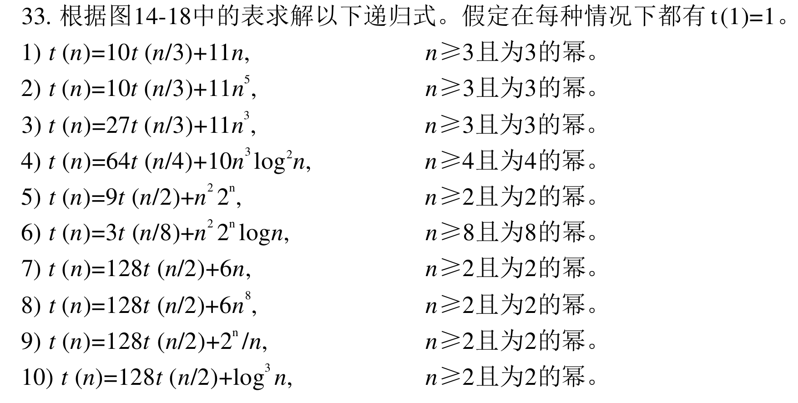
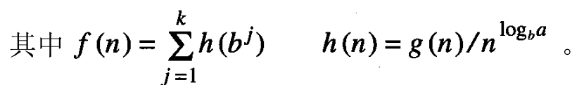
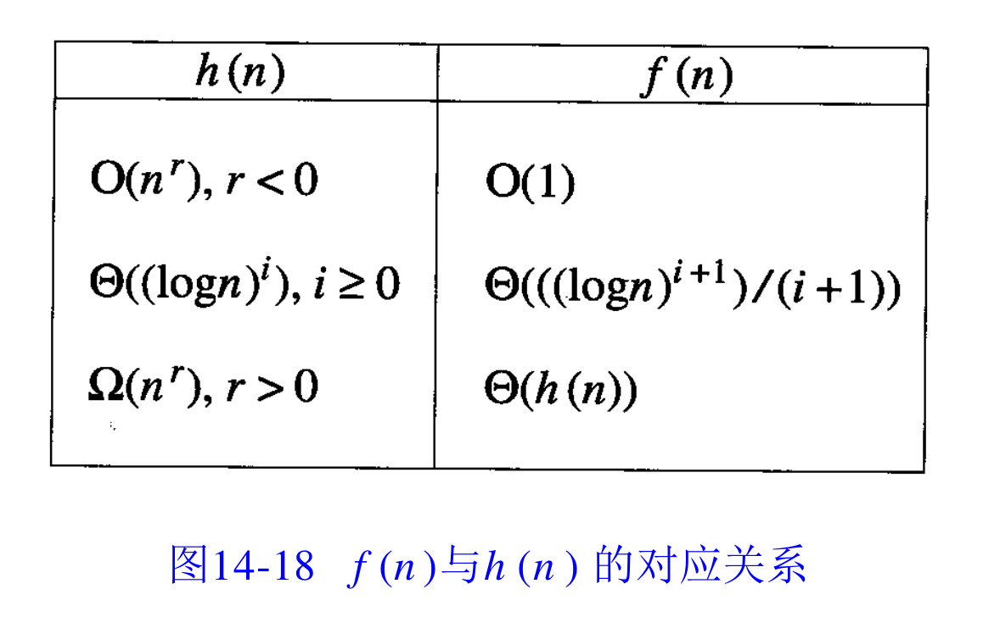

# 1
根据图 14-18 中的表求解以下递归式。假定在每种情况下都有 $t(1)=1$。
1. $t(n) = 10t(n/3) + 11n$,  $\qquad n \ge 3$ 且为 3 的幂。
2. $t(n) = 10t(n/3) + 11n^5$, $\qquad n \ge 3$ 且为 3 的幂。
3. $t(n) = 27t(n/3) + 11n^3$, $\qquad n \ge 3$ 且为 3 的幂。
4. $t(n) = 64t(n/4) + 10n^3 \log^2 n$, $\qquad n \ge 4$ 且为 4 的幂。
5. $t(n) = 9t(n/2) + n^2 2^n$, $\qquad n \ge 2$ 且为 2 的幂。
6. $t(n) = 3t(n/8) + n^2 2^n \log n$, $\qquad n \ge 8$ 且为 8 的幂。
7. $t(n) = 128t(n/2) + 6n$, $\qquad n \ge 2$ 且为 2 的幂。
8. $t(n) = 128t(n/2) + 6n^8$, $\qquad n \ge 2$ 且为 2 的幂。
9. $t(n) = 128t(n/2) + 2^n / n$, $\qquad n \ge 2$ 且为 2 的幂。
10. $t(n) = 128t(n/2) + \log^3 n$, $\qquad n \ge 2$ 且为 2 的幂。
### 图 14-18 $f(n)$ 与 $h(n)$ 的对应关系

其中 $h(n) = \frac{g(n)}{n^{\log_b a}}$，最终解为 $t(n) = \Theta(n^{\log_b a} \cdot f(n))$。

| $h(n)$ | $f(n)$ |
| --- | --- |
| $O(n^r), r < 0$ | $O(1)$ |
| $\Theta((\log n)^i), i \ge 0$ | $\Theta\left(\frac{(\log n)^{i+1}}{i+1}\right)$ |
| $\Omega(n^r), r > 0$ | $\Theta(h(n))$ |

---

**💡 备忘提示**：第 7) 到第 10) 题的 $a=128, b=2$，核心项均为 $n^{\log_2 128} = n^7$。你在做后面几题时可以批量处理。

# 2
分析：当r=3时是否能在时间复杂度O(n)内求解选择问题？
计算：当r=7时选择算法的时间复杂度是多少？

# 3
证明:由普通2x2分块矩阵乘法推导得的分治法算法，其时间复杂度为$\Theta(n^3)$，参见课本P435例14-3。

# 4
推导课本P442递归式(14.7)
