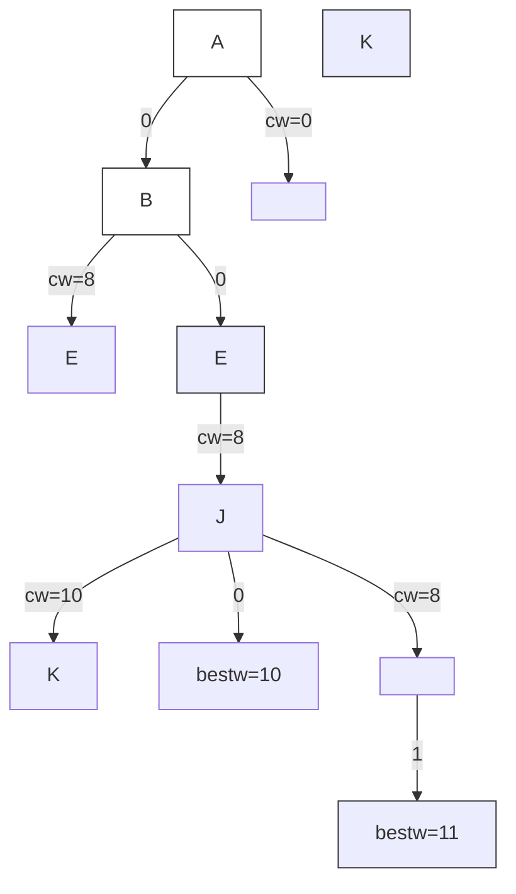
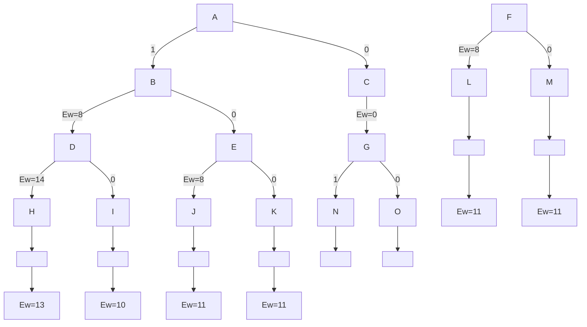

# 算法设计与分析（复习课）

> 本复习课涵盖了算法设计与分析课程中的 10 道典型考题，涉及 NP 理论、时间复杂度分析、QuickSort、贪心算法、回溯法、动态规划、渐进符号、分治算法、分支界限法等核心内容。

---

## 一、NP问题与NP-hard问题

**问题：** 解释什么是 NP 问题、NP-hard 问题，并简述二者之间的关系。

**解：**

1. **NP 问题**：不能在多项式时间内解决（或不能确定能不能在多项式时间内解决），但能在多项式时间内验证的问题。
2. **NP-Hard 问题（NP难问题）**：所有 NP 问题在多项式时间内都能规约（Reduction）到它的问题，但它本身不一定是 NP 问题。
3. **二者关系**：NP 问题有可能是 NP-hard 问题，NP-hard 问题也可能是 NP 问题，两者存在交集部分，并不完全对立。

> **💡 初学者贴士：**
> - **P 问题**：能在多项式时间内解决（如排序）
> - **NP 问题**：能在多项式时间内验证解是否正确（如数独）
> - **NP-hard 问题**：比所有 NP 问题都"难"或"一样难"，但不一定能在多项式时间内验证
> - **NP-complete 问题**：既是 NP 又是 NP-hard（如旅行商问题）

---

## 二、程序段时间复杂度分析

**问题：** 分析下面程序段所描述算法的最好、最坏及平均情形的时间复杂度，要求写出分析的具体过程。

```cpp
template <class T>
void insert(T a[], int &n, const T& x)
{
    int i;
    for (i = n - 1; i >= 0 && x < a[i]; i--)
        a[i + 1] = a[i];
    a[i + 1] = x;
    n++;
}
```

### 最好情形分析

- **情形**：`x >= a[n-1]`，直接插到数组末尾
- for 循环条件第一次就失败（只做 1 次关键比较）
- 循环体不执行，不发生元素搬移
- 故 **T_best(n) = 1**，渐进复杂度 **O(1)**

### 最坏情形分析

- **情形**：`x < a[0]`，需要插到最前面
- for 循环中比较 `x < a[i]` 成立 n 次，循环体执行 n 次
- 同时发生 n 次元素右移，再做一次最终赋值
- 故 **T_worst(n) = n**，渐进复杂度 **O(n)**

### 平均情形分析

- 在 n 个有序元素中，有 **n+1** 个可插入位置
- 对应比较次数可记作：`1, 2, 3, ..., n, n`（共 n+1 种）

平均比较次数：

$$
\begin{aligned}
E[T(n)] &= (1 + 2 + \dots + n + n) / (n + 1) \\
&= \frac{n(n+1)/2 + n}{n+1} \\
&= \frac{n}{2} + \frac{n}{n+1}
\end{aligned}
$$

平均渐进复杂度：**O(n)**

### 完整答案汇总

| 情形 | 条件 | 比较次数 | 渐进复杂度 |
|------|------|---------|-----------|
| 最好 | x ≥ a[n-1] | 1 | O(1) |
| 最坏 | x < a[0] | n | O(n) |
| 平均 | n+1 种插入位置 | n/2 + n/(n+1) | O(n) |

---

## 三、Function + Partition 时间复杂度分析（QuickSort）

**问题：** 分析 Function 函数所描述的算法最好情形和最坏情形的时间复杂度。

```cpp
template <class Type>
Function(a, p, r)
{
    if (p < r) {
        q ← Partition(a, p, r)
        Function(a, p, q - 1)
        Function(a, q + 1, r)
    }
}

Partition(A, p, r)
{
    x ← A[p]           // 选第一个元素为基准
    i ← p
    for j ← p + 1 to r do
        if A[j] ≤ x then
        {
            i ← i + 1
            exchange A[i] ↔ A[j]
        }
    exchange A[p] ↔ A[i]
    return i
}
```

### 算法结构识别

Function 调用 Partition 后递归处理左右子区间，本质是 **快速排序（QuickSort）**。

### 单次划分 Partition 的时间

设子数组长度 $n = r - p + 1$。for 循环 $j = p+1 .. r$ 共执行 $n-1$ 次，每次仅 O(1) 比较/交换。故 **Partition(n) = O(n)**。

### 递归总复杂度取决于每次划分是否均衡

#### 最好情形：O(n log n)

**条件**：每次都均衡划分（左右规模约 n/2）

递归方程：$T(n) = 2T(n/2) + O(n), \quad T(1) = O(1)$

递归树分析：

| 层数 | 子问题个数 × 单个规模 | 该层总代价 |
|------|---------------------|-----------|
| 0 | 1 × n | c·n |
| 1 | 2 × (n/2) | c·n |
| 2 | 4 × (n/4) | c·n |
| ... | ... | ... |
| k | $2^k \times (n/2^k)$ | c·n |

树高 ≈ $\log n$，每层总代价 ≈ $c·n$。

**总复杂度：$T(n) = O(n \log n)$**

#### 最坏情形：O(n²)

**条件**：每次划分都极端不均衡（一个子问题规模 n-1，另一个规模 0）

递归方程：$T(n) = T(n-1) + O(n), \quad T(1) = O(1)$

| 层数 | 唯一子问题规模 | 该层代价 |
|------|--------------|---------|
| 0 | n | c·n |
| 1 | n-1 | c·(n-1) |
| 2 | n-2 | c·(n-2) |
| ... | ... | ... |
| n-1 | 1 | c·1 |

**示例**：$A = [1,2,3,4,5]$（升序），每轮基准都是当前最小值，递归深度 = 5，退化为单链。

$$
T(n) = c[n + (n-1) + \dots + 1] = c \cdot \frac{n(n+1)}{2} = O(n^2)
$$

### 完整答案

Function 函数调用 Partition 函数，Partition 的复杂度为 O(n)。Function 使用递归调用，通过列递归方程分析复杂度。

1. **最好情况**：Partition 可将数组均衡划分
   $$
   T(n) = \begin{cases}
   O(1) & n \leq 1 \\
   2T(n/2) + O(n) & n > 1
   \end{cases}
   $$
   结果：**T(n) = O(n log n)**

2. **最坏情况**：
   $$
   T(n) = \begin{cases}
   O(1) & n \leq 1 \\
   T(n-1) + O(n) & n > 1
   \end{cases}
   $$
   
   结果：$T(n) = O(n²)$

### Function + Partition 执行轨迹（S1-S6）

以 $A = [4, 2, 6, 1, 3, 5, 7]$，基准 $x=4$ 为例：

| 步骤 | p | r | x | i | j | 操作 |
|------|---|---|---|---|---|------|
| S1 进入 Function(a,0,6) | 0 | 6 | - | - | - | 准备调用 Partition |
| S2 Partition 初始化 | 0 | 6 | 4 | 0 | 1 | x=A[p]=4, i=p=0, j=1 |
| S3 j=1 | 0 | 6 | 4 | 1 | 1 | A[1]≤x, i:0→1, 交换 A[1]↔A[1]（自交换） |
| S4 j=2 | 0 | 6 | 4 | 1 | 2 | A[2]=6 > x, i 不变 |
| S5 j=3 | 0 | 6 | 4 | 2 | 3 | A[3]=1≤x, i:1→2, 交换 A[2]↔A[3] |
| S6 j=4 | 0 | 6 | 4 | 3 | 4 | A[4]=3≤x, i:2→3, 交换 A[3]↔A[4] |

> 后续步骤与前 6 步同理，分别递归处理左右子树。

---

## 四、贪心算法 — 活动安排问题（Interval Partitioning）

**问题：** 假定有一组活动，任意活动 i 都可用 $[s_i, f_i)$ 来表示，其中 $s_i$ 表示活动 i 的起始时间，$f_i$ 表示活动 i 的结束时间。需要将它们安排到一些教室，只要活动时间不重叠，任意活动都可以在任意教室进行，希望使用最少的教室完成所有活动。设计一个高效的贪心算法求每个活动应该在哪个教室进行。

1. 写出算法的伪代码
2. 分析所设计的贪心算法的复杂度
3. 以 $\{[1,4), [2,5), [6,7), [4,8)\}$ 四个活动为例，给出教室安排的结果及所使用的教室数量，并分析算法是否可以得到问题最优解

### 问题分析

- 活动 i 用 $[s_i, f_i)$ 表示，任意教室可安排多个不重叠活动
- 目标：为所有活动安排教室，并使教室总数最少
- 核心：这是 **区间分配（Interval Partitioning）** 问题
- 高效策略：按开始时间排序 + 维护"最早空闲教室"最小堆（Min-Heap）

### 算法伪代码

1. 先对所有活动按开始时间从小到大排序
2. 安排第一个活动，随便选取一个教室，然后把这个教室的可用时间更新为该活动的结束时间
3. 安排第 m 个活动时，尽可能选择被安排过活动且当前尽早被释放出来的教室
4. 安排该活动（将所有被安排过活动的教室的可用时间做升序排列），直到所有活动都被安排完毕
5. 返回活动安排结果

### 复杂度分析

与所使用的排序算法有关，为 **O(n²)** 或 **O(n log n)**（若使用高效排序 + 最小堆优化）。

### 实例演示

活动集合：$\{[1,4), [2,5), [6,7), [4,8)\}$

**安排结果：**

- **Room 1**: [1,4), [4,8) （注意 [1,4) 和 [4,8) 在端点处不重叠）
- **Room 2**: [2,5), [6,7)

**使用教室数量：2**

这是问题的最优解（因为活动 [1,4) 和 [2,5) 时间重叠，至少需要 2 个教室）。

---

## 五、回溯法 — 装船问题

**问题：** 试用带限界的回溯法求解装船问题的实例：$n = 4, w = [8, 6, 2, 3], c_1 = 12$。

1. 写出两种限界方法
2. 展开的部分状态空间树（使用定长元组表示）并标明相应的参数

> **💡 装船问题简介：** 有 n 个集装箱要装上一艘载重量为 c₁ 的轮船，每个集装箱 i 的重量为 wᵢ，要求在不超过载重的前提下装载尽可能多的集装箱重量。

### 限界方法

**限界条件 1（约束条件）**：设 cw 为已装重量，若 $cw + w_i > c_1$ 则杀死该子结点（不可行）。

**限界条件 2（限界函数）**：设 bestw 为当前最优装船重量，r 为剩余货箱的总重量，若 $cw + r \leq \text{bestw}$，则停止产生该结点及其子结点（不可能优于当前最优解）。

### 状态空间树



---

## 六、动态规划基本思想

**问题：** 动态规划算法通常适用于解决哪一类问题，并简述动态规划算法的基本思想。

**解：**

动态规划算法通常用于求解**优化问题**（Optimization Problem）。

**基本思想**：将原问题拆解成若干个子问题，并通过存储子问题的解来避免重复计算（即**记忆化**），从而求解原问题的最优解。

> **💡 初学者贴士：动态规划四步法**
> 1. **定义状态**：明确 dp[i] 表示什么
> 2. **状态转移方程**：找到 dp[i] 与 dp[i-1] 等的关系
> 3. **初始化**：确定边界值
> 4. **求解目标**：明确最终答案在 dp 数组中的位置

---

## 七、渐进符号 Ω 等式判断

**问题：** 根据渐进符号 Ω 的定义判断等式 $\Omega(f(n)) + \Omega(g(n)) = \Omega(\min\{f(n), g(n)\})$ 是否成立。若成立，请给出简单的推导过程，若不成立，请给出正确的结果。

> **💡 Ω 符号定义：** $f(n) = \Omega(g(n))$ 当且仅当存在正常数 c 和 $n_0$，使得对于所有 $n \geq n_0$，有 $f(n) \geq c \cdot g(n)$。Ω 表示**渐进下界**。

**【结论】** 等式成立：$\Omega(f(n)) + \Omega(g(n)) = \Omega(\min\{f(n), g(n)\})$

**推导过程：**

1. 令 $f_1(n) = \Omega(f(n))$，$g_1(n) = \Omega(g(n))$，由 Ω 定义需证明：存在正常数 c 和自然数 N，当 $n \geq N$ 时 $f_1(n) + g_1(n) \geq c \cdot \min\{f(n), g(n)\}$

2. 由 Ω 定义：
   - 存在正常数 $c_1$ 和自然数 $n_1$，当 $n \geq n_1$ 时，$f_1(n) \geq c_1 \cdot f(n)$
   - 存在正常数 $c_2$ 和自然数 $n_2$，当 $n \geq n_2$ 时，$g_1(n) \geq c_2 \cdot g(n)$

3. 两式相加：
   $$f_1(n) + g_1(n) \geq c_1 \cdot f(n) + c_2 \cdot g(n)$$

4. 令 $c_3 = \min\{c_1, c_2\}$, $n_3 = \max\{n_1, n_2\}$，当 $n \geq n_3$ 时，因 $c_3 \leq c_1$ 且 $c_3 \leq c_2$，对非负 $f(n), g(n)$：
   $$c_1 \cdot f(n) + c_2 \cdot g(n) \geq c_3 \cdot f(n) + c_3 \cdot g(n) = c_3 \cdot (f(n) + g(n))$$

5. 因 $f(n) + g(n) \geq 2 \cdot \min\{f(n), g(n)\}$，所以：
   $$c_3 \cdot (f(n) + g(n)) \geq 2 \cdot c_3 \cdot \min\{f(n), g(n)\}$$

6. 合并不等式链：
   $$f_1(n) + g_1(n) \geq c_3 \cdot (f(n) + g(n)) \geq 2 \cdot c_3 \cdot \min\{f(n), g(n)\}$$

7. 存在正常数 $c = 2c_3 > 0$ 和自然数 $N = \max\{n_1, n_2\}$，满足 Ω 定义，故：
   $$f_1(n) + g_1(n) = \Omega(\min\{f(n), g(n)\})$$
   $$\Omega(f(n)) + \Omega(g(n)) = \Omega(\min\{f(n), g(n)\})$$

---

## 八、最大子序列求和（分治算法）

**问题：** 最大子序列求和是指给定一组序列，求所有连续子序列的和中的最大值。例如给定序列 [5, -2, -5, 6] 的最大子序列和是 6。

1. 求序列 [1, 2, -3, 4, -5, 6, 7, 8, -9, 10] 的最大子序列和
2. 试设计分治算法求解最大子序列求和问题，写出算法的伪代码
3. 分析所设计的分治算法的时间复杂度

### 第 1 问

序列 [1, 2, -3, 4, -5, 6, 7, 8, -9, 10] 的最大子序列和需要进行计算。

（逐段分析：从 6 开始累加：6+7=13, +8=21, -9=12, +10=**22** → 最大子序列为 [6, 7, 8, -9, 10]，和为 **22**；也可用 Kadane 算法验证）

### 第 2 问 — 分治算法伪代码

```
Algorithm MaxSub(A, l, r):
    if l == r: return A[l]
    mid ← (l + r) // 2
    leftMax ← MaxSub(A, l, mid)
    rightMax ← MaxSub(A, mid + 1, r)
    crossMax ← CrossSum(A, l, mid, r)
    return max(leftMax, rightMax, crossMax)

Algorithm CrossSum(A, l, mid, r):
    s ← 0; leftBest ← -∞
    for i ← mid downto l:
        s ← s + A[i]; leftBest ← max(leftBest, s)
    s ← 0; rightBest ← -∞
    for j ← mid+1 to r:
        s ← s + A[j]; rightBest ← max(rightBest, s)
    return leftBest + rightBest
```

**分治思路说明**：设区间为 A[l..r]，中点 mid = (l+r)//2

- **情况 A**：最大子序列完全在左半边 A[l..mid]
- **情况 B**：最大子序列完全在右半边 A[mid+1..r]
- **情况 C**：最大子序列跨越中点（左边一段 + 右边一段）
- 最终答案 = max(左答案, 右答案, 跨中点答案)

### 第 3 问 — 时间复杂度分析

递归方程：

$$
T(n) = 2T(n/2) + O(n), \quad n > 1; \quad T(1) = O(1)
$$

原因：每层递归要做两次子问题 + 一次线性 CrossSum（扫描左右各一次）。

**$T(n) = O(n \log n)$**（具体分析过程参考第三题最好情况分析）

> **💡 最大子序列和也可以使用动态规划（Kadane算法）在 O(n) 时间内解决，见第九题。**

---

## 九、最大连续子段和（动态规划）

**问题：** 给定 n 个整数 $x[1, 2, ..., n]$，令 $\text{sum}(i,j) = \sum_{k=i}^{j} x[k] \; (0 \leq i \leq j \leq n)$，利用动态规划算法找出 i 和 j 使得 sum(i,j) 最大化。要求：

1. 定义最优值函数，并写出最优值函数的递归方程
2. 写出求解最优值函数非递归算法的伪代码
3. 写出利用最优值函数求解对应最大值的 i 和 j 的伪代码

### (1) 最优值函数与递推方程

**定义**：dp[j] 表示以 x[j] 结尾的连续子段最大和。

**边界**：$dp[0] = x[0]$

**状态转移**：若把 j 接到前一段更优，则选 $dp[j-1] + x[j]$；否则从 j 重新开始，选 $x[j]$。

$$
dp[j] = \max(dp[j-1] + x[j], \; x[j]), \quad j \geq 1
$$

全局最大值 = $\max(dp[0..n-1])$

> **💡 这个算法也称为 Kadane 算法，是动态规划中最简洁的经典示例。**

### (2) 非递归求 dp 的伪代码

```
Algorithm MVCS-Array(x[0..n-1]):
    dp[0] ← x[0]
    for j ← 1 to n-1 do
        if dp[j-1] + x[j] >= x[j] then
            dp[j] ← dp[j-1] + x[j]
        else
            dp[j] ← x[j]
        end if
    end for
    return dp

Algorithm MaxValueFromDP(dp[0..n-1]):
    maxSum ← -∞; endIdx ← 0
    for j ← 0 to n-1 do
        if dp[j] > maxSum then
            maxSum ← dp[j]; endIdx ← j
        end if
    end for
    return (maxSum, endIdx)
```

### (3) 恢复起点 i 与终点 j

```
Algorithm RecoverIndex(x[0..n-1], dp[0..n-1]):
    (maxSum, e) ← MaxValueFromDP(dp)
    sum ← 0; s ← 0
    for k ← e downto 0 do
        sum ← sum + x[k]
        if sum == maxSum then
            s ← k; break
        end if
    end for
    return (s, e, maxSum)
```

### 本题要点

1. 明确写出状态定义：dp[j] 是"以 j 结尾"的最大和
2. 明确写出边界：dp[0] = x[0]
3. 写出递推：$dp[j] = \max(dp[j-1] + x[j], x[j])$
4. 若要求 i, j，必须写恢复步骤，不能只给 maxSum
5. **复杂度**：时间 O(n)，空间 O(n)；一趟优化可到 O(1) 额外空间

### 完整答案（另一表述）

1. 定义 mvcs(i) 为以 x[i] 结尾的连续整数和的最大值：

$$
\operatorname{mvcs}(j) = \begin{cases}
x_j & \text{if } j = 0 \\
\max\{\operatorname{mvcs}(j-1) + x_j, \; x_j\} & \text{else}
\end{cases}
$$

伪代码实现：

```
mvcs(a[], n, m):
    m[0] = a[0];
    for i = 1 to n - 1
        if a[i] > m[i - 1] + a[i]
            m[i] = a[i]
        else
            m[i] = m[i - 1] + a[i]
```

恢复起点的另一种实现：

```
print_index(a[], n, m[]):
    max = INT_MIN
    s, e = 0
    for i = 0 to n-1 {
        if (m[i] > max) {
            max = m[i]
            e = i
        }
    }
    sum = 0
    for j = e downto 0 {
        sum += a[j]
        if sum == max {
            s = j; break
        }
    }
    return s and e
```

---

## 十、分支界限法 — 两艘轮船装载问题

**问题：** 有一批共 n 个集装箱要装上两艘载重量分别为 c₁ 和 c₂ 的轮船，其中集装箱 i 的重量为 wᵢ，且集装箱总重量小于两艘船的载重总量。请确定是否有一个合理的装载方案可将所有的集装箱装上这两艘轮船。

1. 编写一个分支界限算法，搜索可行方案（伪代码即可）
2. 假设 $n = 4, c_1 = 12, c_2 = 8, w = [8, 6, 2, 3]$，画出用分支限界法求解该问题的状态空间树

### 算法伪代码（MaxLoading — 分支限界法）

```
def MaxLoading(w[], c, n):
    // 初始化
    Queue Q              // 活结点队列
    Q.Add(-1)            // 同层结点尾部标志
    i = 1                // 当前扩展结点所处的层
    Ew = 0               // 扩展结点处相应的载重量
    bestw = 0

    // 搜索子集空间树
    while (true):
        // 检查左儿子结点
        if (Ew + w[i] <= c1):           // x[i] = 1
            EnQueue(Q, Ew + w[i], bestw, i, n)  // 将活结点加入队列 Q

        // 右儿子结点总是可行的，将其加入到 Q 中
        EnQueue(Q, Ew, bestw, i, n)     // x[i] = 0

        Q.Delete(Ew)                    // 取下一扩展结点

        if (Ew == -1):                  // 同层结点尾部
            if (Q.IsEmpty()):
                return bestw
            Q.Add(-1)                   // 同层结点尾部标志
            Q.Delete(Ew)                // 取下一扩展结点
            i++                         // 进入下一层
```

### 状态空间树



---

## 附录：渐进符号速查表

| 符号 | 名称 | 含义 | 类比 |
|------|------|------|------|
| $O(g(n))$ | 大 O | $f(n) \leq c \cdot g(n)$（渐进上界） | 不超过 |
| $\Omega(g(n))$ | 大 Ω | $f(n) \geq c \cdot g(n)$（渐进下界） | 不低于 |
| $\Theta(g(n))$ | 大 Θ | $c_1 \cdot g(n) \leq f(n) \leq c_2 \cdot g(n)$（紧界） | 正好相当 |
| $o(g(n))$ | 小 o | $f(n) < c \cdot g(n)$（非紧上界） | 小于 |
| $\omega(g(n))$ | 小 ω | $f(n) > c \cdot g(n)$（非紧下界） | 大于 |
