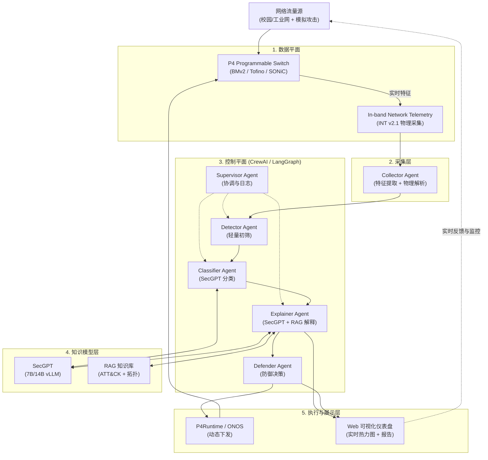

```mermaid
flowchart TD
    %% 外部流量源
    Traffic["网络流量源\n(校园/工业网 + 模拟攻击)"]

    %% 1. 数据平面
    subgraph 数据平面 ["1. 数据平面"]
        direction TB
        P4Switch["P4 Programmable Switch\n(BMv2 / Tofino / SONiC)"]
        INT["In-band Network Telemetry\n(INT v2.1 物理采集)"]
        P4Switch -->|实时特征| INT
    end

    %% 2. 采集层
    subgraph 采集层 ["2. 采集层"]
        Collector["Collector Agent\n(特征提取 + 物理解析)"]
    end

    %% 3. 控制平面 - 多Agent系统
    subgraph 控制平面 ["3. 控制平面 (CrewAI / LangGraph)"]
        direction TB
        Supervisor["Supervisor Agent\n(协调与日志)"]
        Detector["Detector Agent\n(轻量初筛)"]
        Classifier["Classifier Agent\n(SecGPT 分类)"]
        Explainer["Explainer Agent\n(SecGPT + RAG 解释)"]
        Defender["Defender Agent\n(防御决策)"]

        Supervisor -.-> Detector
        Supervisor -.-> Classifier
        Supervisor -.-> Explainer

        Detector --> Classifier
        Classifier --> Explainer
        Explainer --> Defender
    end

    %% 4. 知识模型层
    subgraph 知识模型层 ["4. 知识模型层"]
        direction TB
        SecGPT["SecGPT\n(7B/14B vLLM)"]
        RAG["RAG 知识库\n(ATT&CK + 拓扑)"]
    end

    %% 5. 执行与展示层
    subgraph 执行与展示层 ["5. 执行与展示层"]
        direction TB
        ONOS["P4Runtime / ONOS\n(动态下发)"]
        Dashboard["Web 可视化仪表盘\n(实时热力图 + 报告)"]
    end

    %% 主要数据流向
    Traffic --> P4Switch
    INT --> Collector
    Collector --> Detector
    Classifier <--> SecGPT
    Explainer <--> SecGPT
    Explainer <--> RAG
    Defender --> ONOS
    ONOS --> P4Switch
    Explainer --> Dashboard
    Defender --> Dashboard
    Dashboard -.->|实时反馈与监控| Traffic
```
