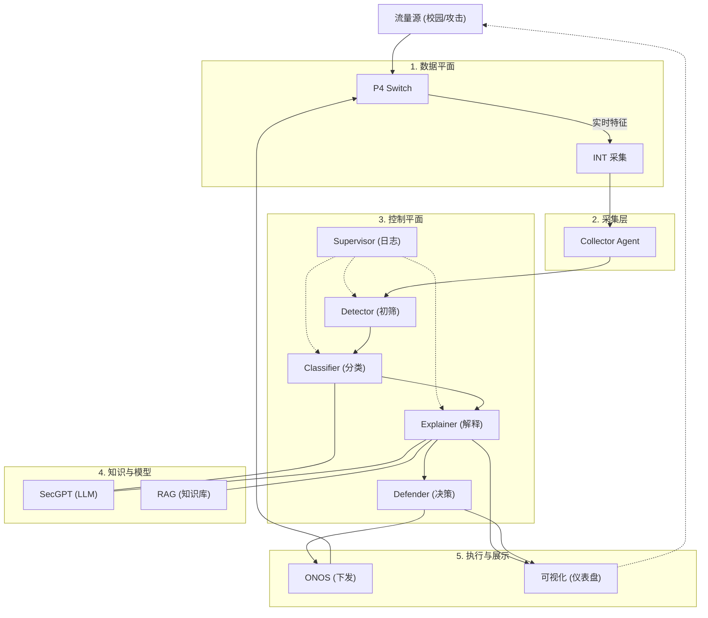

```mermaid
flowchart TD
    %% 外部流量源
    Traffic["流量源 (校园/攻击)"]

    %% 1. 数据平面
    subgraph S1 ["1. 数据平面"]
        direction TB
        P4Switch["P4 Switch"]
        INT["INT 采集"]
        P4Switch -->|实时特征| INT
    end

    %% 2. 采集层
    subgraph S2 ["2. 采集层"]
        Collector["Collector Agent"]
    end

    %% 3. 控制平面
    subgraph S3 ["3. 控制平面"]
        direction TB
        Supervisor["Supervisor (日志)"]
        Detector["Detector (初筛)"]
        Classifier["Classifier (分类)"]
        Explainer["Explainer (解释)"]
        Defender["Defender (决策)"]

        Supervisor -.-> Detector
        Supervisor -.-> Classifier
        Supervisor -.-> Explainer

        Detector --> Classifier
        Classifier --> Explainer
        Explainer --> Defender
    end

    %% 4. 知识与模型
    subgraph S4 ["4. 知识与模型"]
        direction TB
        SecGPT["SecGPT (LLM)"]
        RAG["RAG (知识库)"]
    end

    %% 5. 执行与展示
    subgraph S5 ["5. 执行与展示"]
        direction TB
        ONOS["ONOS (下发)"]
        Dashboard["可视化 (仪表盘)"]
    end

    %% 数据流
    Traffic --> P4Switch
    INT --> Collector
    Collector --> Detector

    %% 知识交互 (使用水平连接避免过宽)
    Classifier --- SecGPT
    Explainer --- SecGPT
    Explainer --- RAG

    %% 执行流
    Defender --> ONOS
    ONOS --> P4Switch
    Explainer --> Dashboard
    Defender --> Dashboard
    Dashboard -.-> Traffic
```
