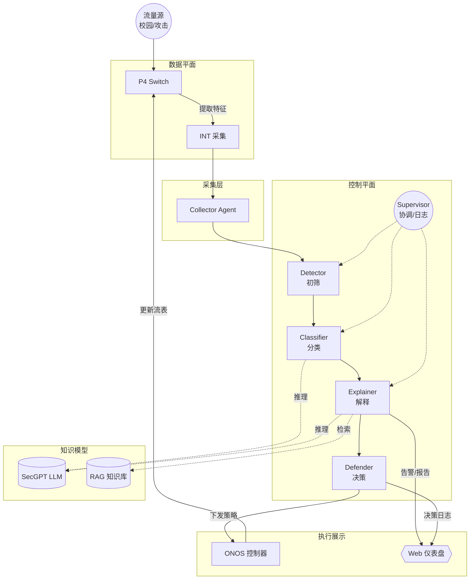

```mermaid
flowchart TD
    %% 外部流量源
    Traffic((流量源\n校园/攻击))

    %% 核心节点定义
    subgraph 数据平面 [数据平面]
        P4Switch[P4 Switch]
        INT[INT 采集]
    end

    subgraph 采集层 [采集层]
        Collector[Collector Agent]
    end

    subgraph 控制平面 [控制平面]
        Supervisor((Supervisor\n协调/日志))
        Detector[Detector\n初筛]
        Classifier[Classifier\n分类]
        Explainer[Explainer\n解释]
        Defender[Defender\n决策]
    end

    subgraph 知识模型 [知识模型]
        SecGPT[(SecGPT LLM)]
        RAG[(RAG 知识库)]
    end

    subgraph 执行展示 [执行展示]
        ONOS[ONOS 控制器]
        Dashboard{{Web 仪表盘}}
    end

    %% --- 1. 主干数据流 (垂直向下) ---
    Traffic --> P4Switch
    P4Switch -->|提取特征| INT
    INT --> Collector
    Collector --> Detector
    Detector --> Classifier
    Classifier --> Explainer
    Explainer --> Defender

    %% --- 2. 知识库与模型调用 (旁路查询) ---
    Classifier -.->|推理| SecGPT
    Explainer -.->|推理| SecGPT
    Explainer -.->|检索| RAG

    %% --- 3. 监督与协调 (旁路控制) ---
    Supervisor -.-> Detector
    Supervisor -.-> Classifier
    Supervisor -.-> Explainer

    %% --- 4. 执行与反馈 ---
    Defender -->|下发策略| ONOS
    ONOS -->|更新流表| P4Switch

    Explainer -->|告警/报告| Dashboard
    Defender -->|决策日志| Dashboard
```
